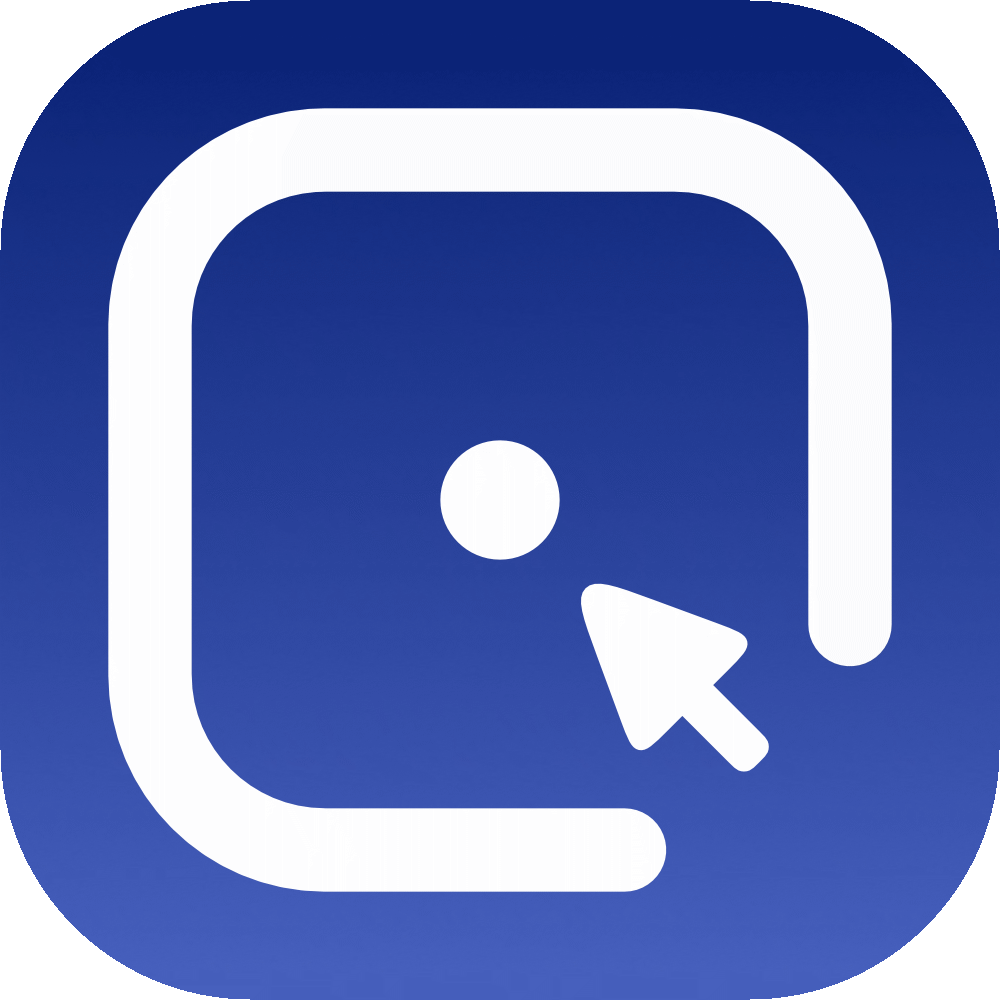

<div align="center">



# 練る · Neru

**Navigate your entire screen without touching the mouse.**


[](docs/LINUX_SETUP.md)


[](https://github.com/y3owk1n/neru/releases)
[](LICENSE)

</div>

---

Neru _(練る — "to refine through practice")_ puts your cursor anywhere on screen using only your keyboard. Click, scroll, drag — all without leaving the home row.

It's a free, open-source alternative to [Homerow](https://www.homerow.app/), [Mouseless](https://mouseless.click/), and [Wooshy](https://wooshy.app). No paywalls, no subscriptions, fully configurable.

> See how the author uses Neru day-to-day → [HOW-I-USE-NERU.md](HOW-I-USE-NERU.md) and a quick demo with `recursive_grid` with my own config:

<https://github.com/user-attachments/assets/6b5673e1-7131-4bc0-ad57-41678e9423b9>

---

## Navigation modes

<table>
<tr>
<td align="center" width="33%">
<br/>
<sub><b>Recursive Grid</b> · recommended</sub>
</td>
<td align="center" width="33%">
<br/>
<sub><b>Grid</b></sub>
</td>
<td align="center" width="33%">
<br/>
<sub><b>Hints</b></sub>
</td>
</tr>
</table>

| Mode                  | How it works                                                      | Best for                                       |
| --------------------- | ----------------------------------------------------------------- | ---------------------------------------------- |
| **Recursive Grid** ⭐ | Divide screen into cells, narrow recursively with `u`/`i`/`j`/`k` | Everything — works in any app, any window      |
| **Grid**              | Coordinate grid, jump by row + column label                       | Quick, coarse navigation                       |
| **Hints**             | Labels appear on every clickable UI element                       | Standard macOS apps with accessibility support |
| **Scroll**            | Vim-style `j`/`k`, `gg`/`G`, `d`/`u`                              | Scrolling without lifting your hands           |

**Recursive Grid is the recommended daily driver.** It's precise, predictable, and requires no per-app setup — it just works everywhere.

---

## Features

- **All mouse actions** — left, right, and middle click; drag & drop; all key-bound
- **Sticky modifiers** — tap `Shift` or `Cmd` once to apply to your next click, no holding
- **Per-app exclusions** — opt specific apps out by bundle ID
- **CLI & scripting** — full IPC-based CLI for shell scripts and hotkey managers
- **TOML config** — every keybinding, color, and behavior in one file you can version-control

Works in native macOS apps, Electron apps (VS Code, Slack, Obsidian), all major browsers, creative tools (Figma, Illustrator), and system UI (Dock, Menubar, Mission Control). Grid and Recursive Grid need no accessibility support — they work universally.

---

## Installation

**macOS (Homebrew — recommended):**

> [!NOTE]
> The homebrew tap is maintained in another repo: [y3owk1n/homebrew-tap](https://github.com/y3owk1n/homebrew-tap)
> If there's a problem with the tap, please open an issue in that repo or even better, a PR.

```bash
brew tap y3owk1n/tap
brew install --cask y3owk1n/tap/neru
```

**macOS / Linux (Nix Flake):**

```bash
# inputs.neru.url = "github:y3owk1n/neru";
# Modules: nix-darwin (macOS) · nixosModules (Linux) · home-manager (both)
# See docs/INSTALLATION.md for full setup
```

**From source (any platform):**

```bash
git clone https://github.com/y3owk1n/neru.git
cd neru && just release
```

**Post-install (macOS):** grant accessibility access — **System Settings → Privacy & Security → Accessibility → enable Neru**.

```bash
open -a Neru              # launch
neru services install     # auto-start on login (use this only if you're not using nix with launchagents enabled)
```

**Post-install (Linux):** see [Linux Setup →](docs/LINUX_SETUP.md) for display-server requirements and permissions.

```bash
neru launch               # launch
```

Full walkthrough: [Installation Guide →](docs/INSTALLATION.md)

---

## Default hotkeys

| Hotkey            | Action            |
| ----------------- | ----------------- |
| `Cmd+Shift+C`     | Recursive Grid ⭐ |
| `Cmd+Shift+G`     | Grid              |
| `Cmd+Shift+Space` | Hints             |
| `Cmd+Shift+S`     | Scroll            |
| `Shift+L`         | Left click        |
| `Shift+R`         | Right click       |

All hotkeys are remappable. See [Configuration Reference →](docs/CONFIGURATION.md#hotkeys)

> **Note:** Adding any custom hotkey replaces all defaults. Re-declare every hotkey you want to keep.

---

## Configuration

Everything lives in `~/.config/neru/config.toml` — one file, plain text, dotfile-friendly.

```bash
neru config init      # generate a commented starter config
neru config validate  # check for errors
neru config reload    # hot-reload into a running daemon
```

Version-control it, share it, script against it. No settings GUI, no hidden state.

Full reference: [Configuration Docs →](docs/CONFIGURATION.md) · Community configs: [Config Showcases →](/docs/CONFIG_SHOWCASES.md)

---

## How Neru compares

### macOS

| Tool                                            | Approach                                         | Price    | Open Source        |
| ----------------------------------------------- | ------------------------------------------------ | -------- | ------------------ |
| **Neru**                                        | Hints + Grid + Recursive Grid + Scroll           | **Free** | ✅                 |
| [Homerow](https://www.homerow.app/)             | Hints (fuzzy search + labels)                    | Paid     | ❌                 |
| [Wooshy](https://wooshy.app)                    | Hints (search-to-click)                          | Paid     | ❌                 |
| [Mouseless](https://mouseless.click/)           | Grid-based pointer control                       | Paid     | ❌                 |
| [Scoot](https://github.com/mjrusso/scoot)       | Hints + Grid + Freestyle                         | Free     | ✅                 |
| [Vimac](https://github.com/dexterleng/vimac)    | Hints + Grid                                     | Free     | ✅ ⚠️ unmaintained |
| [warpd](https://github.com/rvaiya/warpd)        | Hints + Grid + Normal                            | Free     | ✅ ⚠️ low activity |
| [Shortcat](https://shortcat.app/)               | Hints (fuzzy search)                             | Free     | ❌ discontinued    |
| [Glyphlow](https://github.com/blindFS/Glyphlow) | Hints (fuzzy search + labels) + vim text editing | Free     | ✅                 |

### Browser extensions

| Tool                                                | Approach                      |
| --------------------------------------------------- | ----------------------------- |
| [Vimium](https://github.com/philc/vimium)           | Hints-based link navigation   |
| [Vimium C](https://github.com/gdh1995/vimium-c)     | Extended Vimium               |
| [Tridactyl](https://github.com/tridactyl/tridactyl) | Full Vim emulation in Firefox |

---

## Platform support

macOS is fully supported. Linux and Windows currently expose the shared
architecture, ports, and stubs, but still need native implementations for core
functionality. On Linux, the platform factory now distinguishes X11,
wlroots-based Wayland, GNOME Wayland, KDE Wayland, and unknown sessions so the
app can return clearer guidance during startup.

Shared code should prefer platform roles over macOS-specific assumptions:

- Use `Primary` in new cross-platform hotkeys when you mean "Cmd on macOS, Ctrl elsewhere".
- Treat Linux as a backend family, not one target: X11 and Wayland may need separate adapters behind the same port.
- Keep backend selection in platform/infra code so contributors can extend Linux without editing shared mode logic.
- Treat CGO as backend-dependent, not automatically OS-dependent: macOS needs it today, Linux may or may not depending on backend, and Windows should prefer pure-Go Win32 bindings where practical.

| Platform    | Status                     |
| ----------- | -------------------------- |
| **macOS**   | ✅ Stable, all features    |
| **Linux**   | ✅ X11 / Wayland (wlroots) |
| **Windows** | 🔲 Foundations only        |

Linux-specific setup notes and planned backend targets live in
[docs/LINUX_SETUP.md](docs/LINUX_SETUP.md).

**Interested in porting?** Check [`cross-platform` issues](https://github.com/y3owk1n/neru/issues?q=is%3Aopen+is%3Aissue+label%3Across-platform) or join the [Linux discussion](https://github.com/y3owk1n/neru/discussions/559).

Contributor quick start for platform work:

```bash
just build
just test-foundation
just build-linux      # or: just build-windows
```

<details>
<summary>Full compatibility matrix & roadmap</summary>

| Capability                | macOS | Linux | Windows |
| :------------------------ | :---: | :---: | :-----: |
| Recursive Grid            |  ✅   |  ✅   |   🔲    |
| Grid                      |  ✅   |  ✅   |   🔲    |
| Hints                     |  ✅   |  🔲   |   🔲    |
| Vim-Style Scrolling       |  ✅   |  ✅   |   🔲    |
| Direct Mouse Actions      |  ✅   |  ✅   |   🔲    |
| Global Hotkeys            |  ✅   |  ✅   |   🔲    |
| Accessibility Integration |  ✅   |  🔲   |   🔲    |
| Native Overlays           |  ✅   |  ✅   |   🔲    |

**Roadmap**

- **Phase 1 — macOS** ✅
    - [x] Stable core architecture
    - [x] High-performance native bridge
    - [x] Full feature set
- **Phase 2 — Linux**
    - [ ] AT-SPI accessibility integration
    - [x] X11/Wayland event capture
    - [x] Native overlays
- **Phase 3 — Windows**
    - [ ] UI Automation (UIA) integration
    - [ ] Windows Hooks for event capture
    - [ ] Win32/WinUI overlays

</details>

---

## Documentation

| Guide                                          | Contents                                          |
| ---------------------------------------------- | ------------------------------------------------- |
| [Installation](docs/INSTALLATION.md)           | Homebrew, Nix, source builds                      |
| [Configuration](docs/CONFIGURATION.md)         | Every TOML option                                 |
| [CLI](docs/CLI.md)                             | IPC commands and scripting                        |
| [Troubleshooting](docs/TROUBLESHOOTING.md)     | Common issues, app-specific fixes                 |
| [Development](docs/DEVELOPMENT.md)             | Architecture and build instructions               |
| [Architecture](docs/ARCHITECTURE.md)           | Porting guide and system design                   |
| [Cross-Platform Guide](docs/CROSS_PLATFORM.md) | Contributor guide for Linux/Windows/platform work |
| [Roadmap](docs/ROADMAP.md)                     | Current priorities and milestones                 |

---

## Contributing

The project is small and the codebase is approachable. PRs welcome.

```bash
git checkout -b feature/your-idea
just test && just lint
# open a PR
```

Keep PRs focused on a single change. See [Coding Standards](docs/CODING_STANDARDS.md) and [Development Guide](docs/DEVELOPMENT.md).

---

## Sponsoring

Neru is free and built entirely in my spare time. If it's replaced a paid tool in your workflow, consider sponsoring — it helps justify the hours.

[**GitHub Sponsors →**](https://github.com/sponsors/y3owk1n)

---

## Acknowledgments

Built on the shoulders of [Homerow](https://www.homerow.app/), [Vimac](https://github.com/dexterleng/vimac), [Vimium](https://github.com/philc/vimium), [Mouseless](https://mouseless.click/), and [Shortcat](https://shortcat.app/).

---

## License

MIT — see [LICENSE](LICENSE).

<div align="center">

**Made with ❤️ by [y3owk1n](https://github.com/y3owk1n)**

⭐ Star this repo if Neru makes your workflow better

</div>
