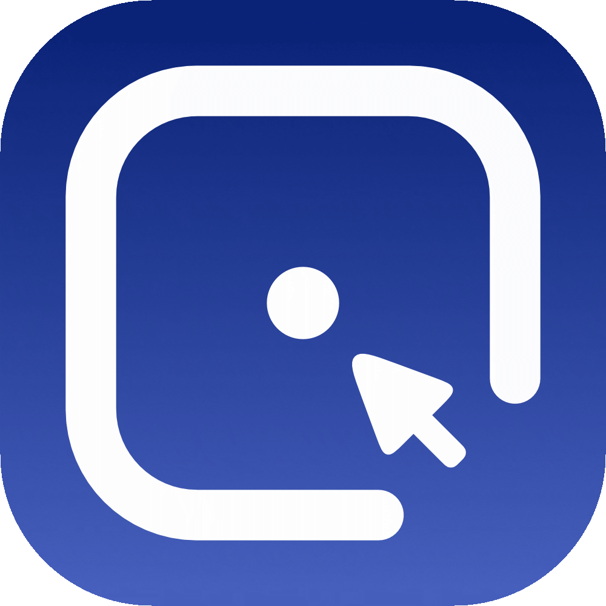

<div align="center">



# Neru

**Navigate your entire screen without touching the mouse.**

_Built for the person who already remapped Caps Lock._


[](https://github.com/y3owk1n/neru/releases)
[](https://discord.gg/KZwnwr9dz6)
[](LICENSE)
[](https://github.com/sponsors/y3owk1n)

**Free and open-source.** No subscription. No trial. No catch.

|    macOS    |      Linux       |     Windows      |
| :---------: | :--------------: | :--------------: |
|  Stable ✅  | Beta — daily 🔵  | Beta — daily 🔵  |

<sub>[What these mean](docs/CROSS_PLATFORM.md#what-the-labels-mean) — stable is fully featured and proven in use, beta is good for daily driving.</sub>

</div>

---

If you use Vimium in the browser, you already know what this feels like. **Neru brings that to your entire operating system** — every app, every window, every menu bar item. Navigate with labels, grids, or vim-style keys. Click, right-click, drag, scroll, select text — all without leaving your keyboard.

Here's the whole flow:

```
Cmd+Shift+Space   →  labels appear on every clickable element
type the label    →  cursor jumps there
Shift+L           →  left click
```

The mouse is now optional.

Unlike most tools in this space, Neru is **CLI-first** — every action is a command, every setting is a plain toml file, everything is scriptable. No settings panel. No GUI preferences window. It lives in your dotfiles like it was always supposed to be there.

---

**See it in action — recursive grid mode in real use:**

https://github.com/user-attachments/assets/6b5673e1-7131-4bc0-ad57-41678e9423b9

---

## Install

**macOS** — Homebrew (recommended):

```bash
brew tap y3owk1n/tap
brew install --cask y3owk1n/tap/neru
neru config init
if [ -f ~/.zshrc ] && ! grep -q 'eval "$(neru completion zsh)"' ~/.zshrc; then; echo 'eval "$(neru completion zsh)"' >> ~/.zshrc; fi
```

<details>
<summary>All platforms — prebuilt binaries</summary>

Download the latest release for your OS from [GitHub Releases](https://github.com/y3owk1n/neru/releases/latest):

| Platform | Architecture          | File                     |
| :------- | :-------------------- | :----------------------- |
| macOS    | Intel (x86_64)        | `neru-darwin-amd64.zip`  |
| macOS    | Apple Silicon (arm64) | `neru-darwin-arm64.zip`  |
| Linux    | x86_64                | `neru-linux-amd64.zip`   |
| Linux    | ARM64                 | `neru-linux-arm64.zip`   |
| Windows  | x86_64                | `neru-windows-amd64.zip` |
| Windows  | ARM64                 | `neru-windows-arm64.zip` |

Archives are built by GitHub Actions, and those published from August 2026
onwards carry a signed build provenance attestation, so you can confirm the one
you downloaded came from this repository before you unpack it:

```bash
gh attestation verify neru-darwin-arm64.zip --repo y3owk1n/neru
```

Each archive also ships a `.sha256` file next to it, readable by `shasum -a 256 -c`
(macOS) or `sha256sum -c` (Linux). That checks the download arrived intact; the
attestation above is what checks where it came from.

Extract the binary or executable and place it on your PATH.

</details>

<details>
<summary>Linux — Nix flake</summary>

Add to your flake inputs, then enable the module:

```nix
services.neru.enable = true;
```

See [Installation Guide](docs/INSTALLATION.md) for nix-darwin, NixOS, and home-manager examples.

</details>

<details>
<summary>From source</summary>

```bash
git clone https://github.com/y3owk1n/neru.git && cd neru
just build   # or just bundle on macOS
just install
```

</details>

---

Once you're done with the installation, you can just run the `Neru.app` (macOS) or the `neru launch` binary (macOS / Linux / Windows). On Windows you can also start Neru from the Start Menu, which runs the same `neru.exe` without a console window. Neru will prompt for config initialization and accessibility permission whenever is needed.

---

## Pick your mode

Five modes, one tool — mix and match as the situation calls for it.

<table>
<tr>
<td align="center" width="33%">
<br/>
<sub><b>Recursive Grid</b> · start here</sub>
</td>
<td align="center" width="33%">
<br/>
<sub><b>Grid</b></sub>
</td>
<td align="center" width="33%">
<br/>
<sub><b>Hints (AX + Vision OCR)</b></sub>
</td>
</tr>
</table>

| Mode                  | Default hotkey        | How it works                                                       | Best for                                         |
| :-------------------- | :-------------------- | :----------------------------------------------------------------- | :----------------------------------------------- |
| **Recursive Grid** ⭐ | `Primary+Shift+C`     | Divides screen into cells; narrow down with home-row keys          | Everything — any app, canvas, or game            |
| **Hints**             | `Primary+Shift+Space` | Labels every clickable element via Accessibility API or Vision OCR | Native apps, Electron (VS Code, Slack), Figma    |
| **Grid**              | `Primary+Shift+G`     | Jump directly to a cell by row + column label                      | Fast coarse movement across large monitors       |
| **Scroll**            | `Primary+Shift+S`     | Vim-style `j`/`k` scrolling, `u`/`d` for half pages                | Reading docs and code without lifting your hands |
| **Monitor Select**    | _unbound_             | Labels each display; type a label to jump the cursor there         | Multi-monitor setups                             |

`Primary` is `Cmd` on macOS and `Ctrl` on Linux and Windows. Monitor Select
ships without a default binding — bind `monitor_select` to any key you like.

**On Linux there are no default global hotkeys.** They are cleared at startup to
avoid colliding with terminal and desktop shortcuts such as `Ctrl+Shift+C`. Bind
the modes yourself in `[hotkeys]`, or in your compositor — see
[Global hotkeys on Linux](docs/CONFIGURATION.md#hotkeys).

All bindings are fully remappable — Colemak, Dvorak, whatever you're on. → [Configuration Reference](docs/CONFIGURATION.md#hotkeys)

---

## CLI-first, by design

Most tools in this space are GUI apps with a settings panel. Neru is the opposite — the CLI is the interface, and config is a file you own.

```bash
neru hints          # trigger hints mode
neru grid           # trigger grid mode
neru recursive_grid # trigger recursive grid mode
neru scroll         # trigger scroll mode
neru config reload  # hot-reload config without restarting
neru status         # check daemon state and permissions
```

Config lives at `~/.config/neru/config.toml` — plain text, version-controllable, and hot-reloadable. Every action is available over IPC, so Neru composes naturally with skhd, Raycast, Alfred, Hammerspoon, or any shell script. If it can run a command, it can drive Neru.

```bash
neru config init      # generate a fully-commented starter config
neru config validate  # check for errors before applying
neru config reload    # apply changes without restarting
```

→ [CLI Reference](docs/CLI.md) · [Configuration Reference](docs/CONFIGURATION.md) · [Config Showcases](docs/CONFIG_SHOWCASES.md)

---

## What people are saying

> _"neru: the ACTUAL BEST app for ditching mouse"_

[](https://www.youtube.com/watch?v=OFnpYTDA2gY)

Watch the author run their entire daily workflow without touching the mouse → [HOW-I-USE-NERU.md](HOW-I-USE-NERU.md)

Got questions or want to share your setup? [Join the Discord →](https://discord.gg/KZwnwr9dz6)

---

## Neru Dojo — build your muscle memory 🥋

The community built a browser-based training game to help you get fast with recursive grid and hints. Practice target acquisition, sharpen your reaction time, get reps in before it clicks.

👉 **[Play Neru Dojo](https://bernatgene.github.io/neru-dojo/)** — no install, works in any browser.

https://github.com/user-attachments/assets/d99328a6-b5f9-402a-a01b-297da2ffb454

---

## How Neru compares

| Tool                                                   | Approach                                          |  Price   |    Open Source    |
| :----------------------------------------------------- | :------------------------------------------------ | :------: | :---------------: |
| **Neru**                                               | Grid + Recursive Grid + AX Hints + Vision OCR     | **Free** |        ✅         |
| [Homerow](https://www.homerow.app/)                    | AX-Tree Hints                                     |   Paid   |        ❌         |
| [Wooshy](https://wooshy.app)                           | AX-Tree Search-to-click                           |   Paid   |        ❌         |
| [Mouseless](https://mouseless.click/)                  | Grid pointer control                              |   Paid   |        ❌         |
| [Scoot](https://github.com/mjrusso/scoot)              | AX Hints + Grid                                   |   Free   |        ✅         |
| [Glyphlow](https://github.com/blindFS/Glyphlow)        | Hints + vim text editing                          |   Free   |        ✅         |
| [Stochos](https://github.com/museslabs/stochos)        | Keyboard driven mouse control                     |   Free   |        ✅         |
| [warpd](https://github.com/rvaiya/warpd)               | Grid + Hints + Normal Pointer                     |   Free   |        ✅         |
| [Mousemaster](https://github.com/petoncle/mousemaster) | Grid + Hints + Continuous Pointer + Key Remapping |   Free   |        ✅         |
| [Vimac](https://github.com/dexterleng/vimac)           | AX Hints                                          |   Free   | ✅ (unmaintained) |

More modes, more engines, more platforms — and it's free. If you've been paying for any of the tools above, Neru is worth 10 minutes of your time.

---

## Platform support

| Capability                | macOS | Linux | Windows |
| :------------------------ | :---: | :---: | :-----: |
| Recursive Grid            |  ✅   |  ✅   |   ✅    |
| Grid                      |  ✅   |  ✅   |   ✅    |
| Vim-Style Scroll          |  ✅   |  ✅   |   ✅    |
| Hints (Accessibility API) |  ✅   |  🔵   |   🔵    |
| Hints (Vision OCR)        |  ✅   |  🔵   |   🔲    |
| Direct Mouse Injection    |  ✅   |  ✅   |   ✅    |
| Global Hotkeys            |  ✅   |  ✅   |   ✅    |
| Native Overlays           |  ✅   |  ✅   |   ✅    |
| Monitor Select            |  ✅   |  ✅   |   🔲    |

✅ full · 🔵 works with limits · 🔲 not available

**Hints caveats.** On **Linux**, hints work through AT-SPI, so coverage depends
on the app exposing an accessibility tree (GTK/Qt do; Chromium and Electron apps
need `--force-renderer-accessibility`). Where that tree is too thin, Vision OCR
is the fallback — tesseract, text only, and on KDE behind a one-time
screen-sharing prompt, because KWin's only pixel source is the desktop portal.
On **Windows**, UI Automation reports the control view only,
per-app config does not re-apply when you change windows,
and the OCR fallback is `Windows.Media.Ocr`, text only, needing a language pack. **Linux requires X11 or Wayland on
wlroots/KWin — GNOME Wayland is not supported**; use a GNOME X11 session.

→ [Roadmap](docs/ROADMAP.md) · [Cross-platform details](docs/CROSS_PLATFORM.md)

---

## Documentation

Everything you need to go deep:

**Using Neru**

| Guide                                            | What's in it                                             |
| :----------------------------------------------- | :-------------------------------------------------------- |
| [Installation](docs/INSTALLATION.md)             | Homebrew, Nix, prebuilt binaries, source, permissions     |
| [CLI Reference](docs/CLI.md)                     | Every command, flag, and argument                         |
| [Configuration Reference](docs/CONFIGURATION.md) | Every option, with types, defaults, and platform support  |
| [Tips & Tricks](docs/TIPS_TRICKS.md)             | Worked configuration recipes                              |
| [Config Showcases](docs/CONFIG_SHOWCASES.md)     | Real setups shared by the community                       |
| [Troubleshooting](docs/TROUBLESHOOTING.md)       | Common issues and fixes                                   |

**Platform support**

| Guide                                          | What's in it                                              |
| :--------------------------------------------- | :-------------------------------------------------------- |
| [Cross-Platform Guide](docs/CROSS_PLATFORM.md) | What works on each platform, and how it is implemented    |
| [Linux Setup](docs/LINUX_SETUP.md)             | Dependencies, permissions, building, deployment           |
| [Linux Desktops](docs/LINUX_DESKTOPS.md)       | Per-desktop setup, protocol support, and known issues     |

**Working on Neru**

| Guide                                            | What's in it                                            |
| :----------------------------------------------- | :-------------------------------------------------------- |
| [Contributing](CONTRIBUTING.md)                  | How to propose, commit, and land a change                 |
| [Development Guide](docs/DEVELOPMENT.md)         | Setup, building, testing, debugging, where code goes      |
| [Architecture](docs/ARCHITECTURE.md)             | Layers, boundaries, data flow, platform isolation         |
| [Agent Guide](AGENTS.md)                         | Conventions and contracts, for humans and AI agents       |
| [Roadmap](docs/ROADMAP.md)                       | What's coming next                                        |

---

## Contributing

Neru is written in Go and Objective-C with a hexagonal architecture whose rules
are **executable**: the guardrail tests in
[`internal/architecture/`](internal/architecture/) pin the layering, platform
isolation, port/mock parity, and even doc-link integrity — each with a comment
explaining the real bug it prevents. If you break a rule, the failure message
tells you how to fix it. Adding a feature or platform adapter is straightforward,
and pull requests are very welcome.

```bash
git checkout -b feature/your-feature
just ci   # the same recipes CI gates on, on your host only
# open a pull request
```

→ [Contributing Guide](CONTRIBUTING.md) · [Development Guide](docs/DEVELOPMENT.md)

---

## Support the project

Neru is built and maintained by one person, entirely in spare time. If it's earned a place in your workflow, a sponsorship goes a long way:

👉 [GitHub Sponsors](https://github.com/sponsors/y3owk1n)

---

## Just need window management?

mimi grew out of this project — it's the window and space management pieces extracted into a standalone tool, for when neru is more than you need.

```bash
brew install --cask y3owk1n/tap/mimi
```

→ [github.com/y3owk1n/mimi](https://github.com/y3owk1n/mimi)

---

## License

MIT — see [LICENSE](LICENSE).

<div align="center">
<br/>

**Stop reaching for the mouse. It takes one command.**

```bash
brew install --cask y3owk1n/tap/neru  # macOS
# or download a binary: github.com/y3owk1n/neru/releases/latest
```

<br/>

Welcome to the mouseless life.<br/><br/>
Made with ❤️ by <a href="https://github.com/y3owk1n">y3owk1n</a>

</div>
