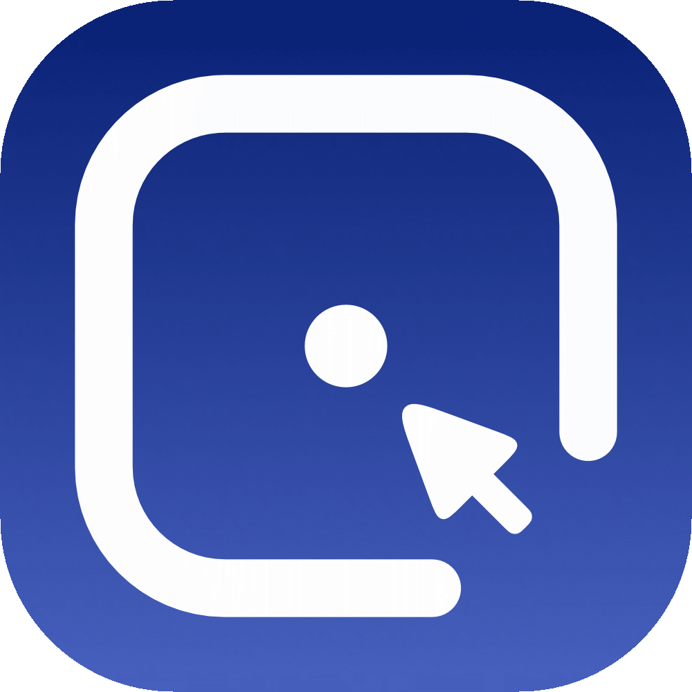

<div align="center">



# Neru

Hints, grids and vim keys for your whole desktop. Free, open source, one binary, one TOML file.

[](https://github.com/y3owk1n/neru/releases)
[](LICENSE)
[](https://discord.gg/KZwnwr9dz6)
[](https://github.com/sponsors/y3owk1n)

|     macOS 14+     |   Linux (X11, Wayland)   |     Windows 10+     |
| :---------------: | :----------------------: | :-----------------: |
|     Stable ✅     |      Beta, daily 🔵      |    Beta, daily 🔵   |

<sub>Beta means every option, flag and action already works. Stable comes after six clean releases. [What the labels mean](docs/reference/platform-support.md#what-the-labels-mean)</sub>

</div>

---

https://github.com/user-attachments/assets/f4c86753-0109-47c9-a94e-775af2546a17

Neru does what Vimium does in the browser, for every app, window, menu bar and dock item on your screen. Press a hotkey, type the label on the element you want, and the cursor jumps there and clicks.

## Why Neru

- **Works where accessibility trees don't.** Grid modes split pixels, not widgets, so they work in canvases, games and remote desktops. Hints use the accessibility tree, on-device OCR, or a pure-Go contour scan.
- **Fast.** The event tap sits on every keystroke, and Neru treats any added latency as a bug.
- **No per-app hacks.** Good defaults, plus per-app overrides you write yourself, applied when focus changes.
- **Scriptable.** Hotkeys, the `neru` CLI and the IPC socket run the same commands, so a binding works unchanged from skhd, Hammerspoon, Raycast or a shell script.
- **Private.** OCR and element detection run on-device. No telemetry, no accounts, and typed text never reaches the log.
- **Fails loudly.** A mistyped flag in a binding fails config validation instead of doing nothing when you press the key.

## Install

```bash
# macOS / Linux
curl -fsSL https://raw.githubusercontent.com/y3owk1n/neru/main/scripts/install.sh | bash
```

```powershell
# Windows
irm https://raw.githubusercontent.com/y3owk1n/neru/main/scripts/install.ps1 | iex
```

The script installs the binary, man pages and shell completions, offers a login service, and updates in place when you run it again. Homebrew, Nix, prebuilt binaries, source builds and uninstalling are in [Installation](docs/guide/installation.md). Two agent skills for Claude Code, Codex and Cursor can answer questions and write your config, see [Set up with an agent](docs/guide/installation.md#set-up-with-an-agent).

## Quick start

1. Run `neru launch`, or skip it if the login service is running.
2. Grant the permissions `neru doctor` reports as missing. See [Permissions](docs/guide/getting-started.md#permissions).
3. Run `neru config init` to write a commented starter config.
4. Press `Primary+Shift+Space` for hints. On Linux, [bind a key first](docs/guide/getting-started.md#binding-your-first-hotkeys).

## Modes

<table>
<tr>
<td align="center" width="50%">
<br/>
<sub><b>Recursive Grid</b></sub>
</td>
<td align="center" width="50%">
<br/>
<sub><b>Hints</b></sub>
</td>
</tr>
<tr>
<td align="center" width="50%">
<br/>
<sub><b>Bisect</b></sub>
</td>
<td align="center" width="50%">
<br/>
<sub><b>Grid</b></sub>
</td>
</tr>
</table>

| Mode                  | Default hotkey        | How it works                                                    | Best for                                    |
| :-------------------- | :-------------------- | :-------------------------------------------------------------- | :------------------------------------------ |
| **Recursive Grid** ⭐ | `Primary+Shift+C`     | Halve the screen with home-row keys until the cursor lands      | Anything, including canvases and games      |
| **Bisect**            | `Primary+Shift+B`     | `hjkl` keep a half, `yubn` a quadrant, until the cursor lands   | Anything, without reading labels            |
| **Hints**             | `Primary+Shift+Space` | Labels every target via accessibility tree, OCR or contour scan | Native apps, Electron, browsers, Figma      |
| **Grid**              | `Primary+Shift+G`     | Type a row and column label to jump to a cell                   | Coarse jumps across big monitors            |
| **Scroll**            | `Primary+Shift+S`     | `j`/`k`, `u`/`d`, `gg`/`G`, `h`/`l` in any scroll view          | Reading without lifting your hands          |
| **Monitor Select**    | unbound               | Labels each display, type one to jump                           | Multi-monitor setups                        |
| **Your own**          | unbound               | A name, an indicator and a key table you declare in config      | Window management layers, app-specific keys |

`Primary` is `Cmd` on macOS and `Ctrl` on Linux and Windows. Linux ships without these defaults so they never collide with terminal shortcuts. Every binding is remappable.

Every mode gives you left, right and middle click, double and triple click, drag with any button, held-key glide with acceleration, and sticky modifiers.

## Configuration

Everything is one TOML file. Apply edits with `neru config reload`, or change one value with `neru config set`.

```toml
[hotkeys]
"Primary+Shift+Space" = "hints --action left_click"   # click on select, Vimium style
"Primary+Shift+W" = "mode window"

[macros]
click_and_exit = ["action left_click --bail-on-error", "idle"]

[[hints.app_configs]]
bundle_id = "com.brave.Browser"   # bundle ID on macOS, WM_CLASS or app_id on Linux, exe path on Windows
hotkeys = { "Return" = "macro click_and_exit" }

[modes.window]
indicator = "Window"

[modes.window.hotkeys]
"h" = "exec yabai -m window --focus west"
"l" = "exec yabai -m window --focus east"
```

Every hotkey command is also a shell command:

```bash
neru hints --role button --text save   # only buttons whose text matches
neru run "action save_cursor_pos" "hints --action left_click" \
         "action wait_for_mode_exit" "action restore_cursor_pos"
neru config set hints.strategy contour
neru doctor                            # diagnose permissions and backends
```

Themes, indicators, smooth cursor and scroll, virtual pointer, app exclusions and screen-share hiding are options too.

## Documentation

- Using Neru: [Installation](docs/guide/installation.md), [Getting started](docs/guide/getting-started.md), [Recipes](docs/guide/recipes.md), [Troubleshooting](docs/guide/troubleshooting.md), [Linux setup](docs/guide/linux.md), [Linux desktops](docs/guide/linux-desktops.md)
- Reference: [Configuration](docs/reference/configuration.md), [CLI](docs/reference/cli.md), [Scripting and IPC](docs/reference/scripting.md), [Platform support](docs/reference/platform-support.md)
- Working on Neru: [Contributing](CONTRIBUTING.md), [Development](docs/contributing/development.md), [Architecture](docs/contributing/architecture.md), [Roadmap](docs/project/roadmap.md)

## Community

> _"neru: the ACTUAL BEST app for ditching mouse"_

[](https://www.youtube.com/watch?v=OFnpYTDA2gY)

- [Neru Dojo](https://bernatgene.github.io/neru-dojo/): a browser game to train recursive grid and hints.
- [Community configs](docs/project/showcases.md): setups shared by users.
- [Discord](https://discord.gg/KZwnwr9dz6): questions and setups.

## Contributing

Bug reports, especially on Linux and Windows, and pull requests are welcome. Start with [CONTRIBUTING.md](CONTRIBUTING.md).

## Support the project

If Neru has earned a place in your workflow, [sponsor it](https://github.com/sponsors/y3owk1n). Need only window management? [mimi](https://github.com/y3owk1n/mimi) is Neru's window and space features as a standalone tool.

## License

MIT. See [LICENSE](LICENSE).

<div align="center">
<br/>

Made with ❤️ by <a href="https://github.com/y3owk1n">y3owk1n</a>

</div>
