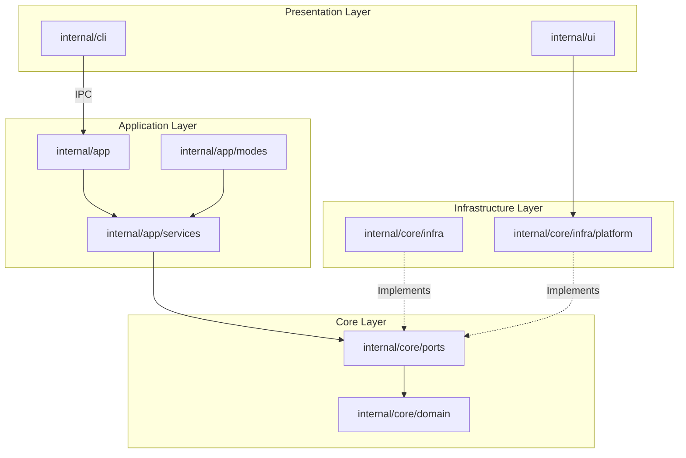

# System Architecture

Neru is a keyboard-driven navigation tool built with Go and Objective-C. It operates as a background daemon that listens for global hotkeys and keyboard events, providing several navigation modes for mouse-free interaction.

---

## Architecture Overview

Neru follows a **Hexagonal Architecture (Ports and Adapters)** pattern:



### Layer Responsibilities

| Layer              | Directory               | Role                                                                                             |
| :----------------- | :---------------------- | :----------------------------------------------------------------------------------------------- |
| **Domain**         | `internal/core/domain/` | Pure business logic and entities (hint generation, grid calculations). No external dependencies. |
| **Ports**          | `internal/core/ports/`  | Interface contracts defining system capabilities (Accessibility, Overlay, Font).                 |
| **Application**    | `internal/app/`         | Orchestrates domain entities and services. Manages lifecycle and navigation modes.               |
| **Infrastructure** | `internal/core/infra/`  | Concrete implementations of ports using platform-specific APIs.                                  |
| **UI**             | `internal/ui/`          | Coordinate transformations and abstract rendering logic.                                         |
| **CLI**            | `internal/cli/`         | User commands, configuration loading, IPC communication with the daemon.                         |

---

## Cross-Platform Design Principles

### Core Principles

1. **Shared Business Logic** — All core logic is written in pure Go in `internal/core/domain` and `internal/app/services`.
2. **Platform Isolation** — OS-specific code is strictly isolated behind port interfaces.
3. **Ports and Adapters** — System capabilities are defined as interfaces (Ports) in `internal/core/ports`. Implementations (Adapters) reside in `internal/core/infra`.
4. **Build Tag Separation** — OS-specific files use Go build tags (e.g., `//go:build darwin`).
5. **Platform Roles Over Brand Names** — Shared code uses terms like "primary modifier", "display server", and "accessibility backend" instead of macOS-specific names like `Cmd`.

### The "One Rule"

> **Non-darwin-tagged code must never import `internal/core/infra/platform/darwin`.**

Violations are caught by `golangci-lint` using `depguard`.

### File Naming Conventions

| Suffix                            | Purpose                       |
| :-------------------------------- | :---------------------------- |
| `*_darwin.go`                     | macOS implementation          |
| `*_windows.go`                    | Windows implementation        |
| `*_linux_common.go`               | Shared Linux wrapper/fallback |
| `*_linux_x11.go`                  | Linux X11 implementation      |
| `*_linux_wayland.go`              | Linux Wayland implementation  |
| `*_linux_wayland_<compositor>.go` | Per-compositor sub-slot       |
| `*_other.go`                      | Non-target fallback           |

---

## Platform Status

| Capability                         | macOS |    Linux    | Windows  |
| :--------------------------------- | :---: | :---------: | :------: |
| Screen bounds / cursor             |  ✅   |     ✅      |    ✅    |
| Global hotkeys                     |  ✅   |     ✅      |    ✅    |
| Keyboard event tap                 |  ✅   |     ✅      |    ✅    |
| Accessibility (clickable elements) |  ✅   | ⬜ (AT-SPI) | ⬜ (UIA) |
| UI overlays                        |  ✅   |     ✅      |    ✅    |
| Dark mode detection                |  ✅   |     ✅      |    ⬜    |
| Notifications / alerts             |  ✅   |     ⬜      |    ⬜    |
| Hints (Vision OCR)                 |  ✅   |     ⬜      |    ⬜    |

⬜ = stub returns `CodeNotSupported`.

---

## Codebase Navigation

### Event Flow

1. **OS Level** — `eventtap_darwin.m` (macOS) captures low-level keyboard events
2. **Infrastructure** — `internal/core/infra/eventtap/adapter.go` dispatches events to the app
3. **Application** — `internal/app/modes/handler.go` routes keys to the active Mode
4. **Service** — The mode calls into services like `hint_service.go` for business logic
5. **Platform** — Services call adapter implementations for OS operations (click, scroll, overlay)

### Key Files

| Purpose                | File                                                        |
| :--------------------- | :---------------------------------------------------------- |
| App startup            | `internal/app/app_initialization.go`                        |
| Mode interface         | `internal/app/modes/base.go`                                |
| Mode implementations   | `internal/app/modes/hints.go`, `grid.go`, `scroll.go`, etc. |
| CLI entry point        | `internal/cli/root.go`                                      |
| Platform factory       | `internal/core/infra/platform/factory.go`                   |
| Capability definitions | `internal/core/ports/capabilities.go`                       |
| Error definitions      | `internal/core/errors/errors.go`                            |
| macOS bridge           | `internal/core/infra/platform/darwin/`                      |
| Linux bridge           | `internal/core/infra/platform/linux/`                       |
| Configuration          | `internal/config/config.go`                                 |

---

## Linux Backend Model

Linux is a **backend family**, not a single target. The runtime compositor is detected and routed at startup.

| Compositor                  | Backend           | Mechanism                      |
| :-------------------------- | :---------------- | :----------------------------- |
| Sway, Hyprland, niri, River | `wayland-wlroots` | `zwlr_virtual_pointer_v1`      |
| KDE Plasma                  | `wayland-kde`     | libei via RemoteDesktop portal |
| X11/XOrg, i3                | `x11`             | XTest, XGrabKey                |
| GNOME                       | `wayland-gnome`   | Not supported                  |

Detection lives in `internal/core/infra/platform/linux_backend.go`. Routing goes through `system_linux_wayland_input.go`.

See [Cross-Platform Contribution Guide](CROSS_PLATFORM.md) for details.

---

## Windows Model

Windows is a single backend family with basic support. Prefers pure Go Win32/COM bindings.

Supported: grid/recursive-grid/scroll modes, mouse injection, global hotkeys, keyboard hooks, UIA accessibility (initial), named-pipe IPC.

---

## Coordinate System

Neru uses a **global top-left (0,0) coordinate system** for all shared logic:

- **Origin:** (0,0) is the top-left corner of the primary display
- **Y-Axis:** Increases downwards
- **Units:** Screen pixels (unscaled)

macOS Cocoa APIs use bottom-left (0,0); the darwin adapter inverts Y coordinates before passing to shared Go code.

---

## Error Handling

Neru uses a custom error package in `internal/core/errors/errors.go`.

### CodeNotSupported Policy

When a platform feature is not yet implemented, return `CodeNotSupported`:

```go
return derrors.New(derrors.CodeNotSupported, "feature X not yet implemented on linux")
```

Callers use `IsNotSupported(err)` to handle missing features gracefully. Prefer explicit `CodeNotSupported` over silent no-ops.

---

## Technology Stack

| Component          | Technology                                                                      |
| :----------------- | :------------------------------------------------------------------------------ |
| Core language      | Go 1.26+                                                                        |
| Native integration | CGo + Objective-C (macOS), C (Linux)                                            |
| CLI framework      | [Cobra](https://github.com/spf13/cobra)                                         |
| Configuration      | [TOML](https://toml.io/)                                                        |
| IPC                | Unix domain sockets                                                             |
| Build system       | [Just](https://github.com/casey/just)                                           |
| CI/CD              | GitHub Actions + [Release Please](https://github.com/googleapis/release-please) |

---

## Security Architecture

1. **Secure Input Detection** — Neru detects when "Secure Input" is enabled (e.g., password field focused) and suspends the event tap.
2. **Permissions** — Requires macOS Accessibility permission. Minimum set of permissions for UI interaction.
3. **IPC Security** — Unix domain sockets with restricted file permissions (`0600`). Only the current user can communicate with the daemon.
4. **No Network Access** — Neru does not make outbound connections, send telemetry, or phone home.

---

## References

- [Cross-Platform Contribution Guide](CROSS_PLATFORM.md)
- [Contributing Guide](../CONTRIBUTING.md)
- [Configuration Guide](CONFIGURATION.md)
- [macOS Accessibility API](https://developer.apple.com/documentation/applicationservices/ax_ui_element_ref)
