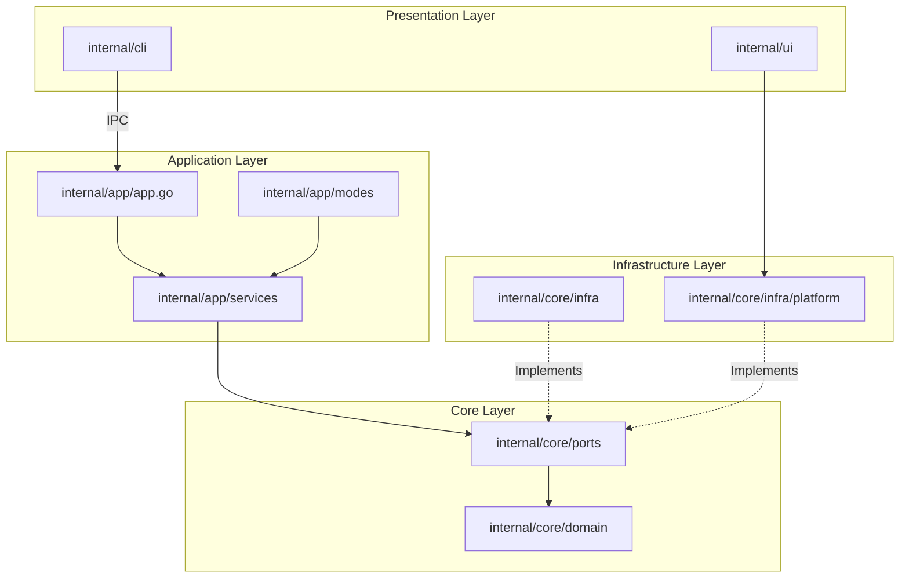
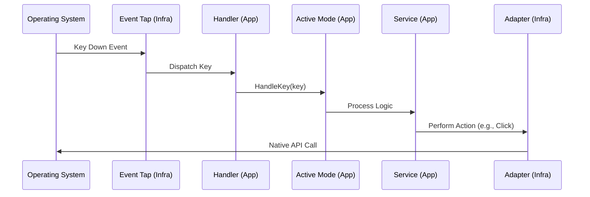
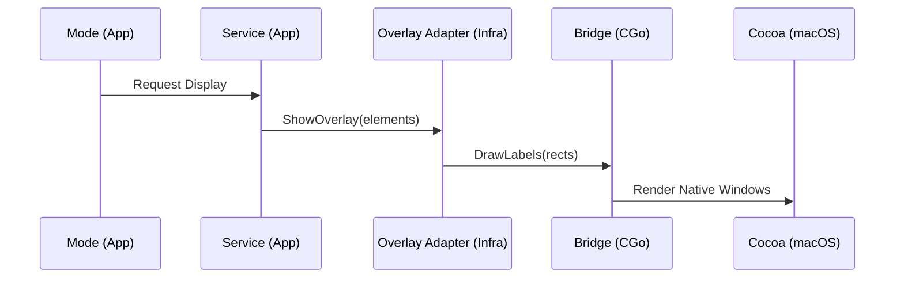

# Neru System Architecture

Neru is a keyboard-driven navigation tool for macOS (with Linux and Windows support in progress) built with Go and Objective-C. It enhances productivity by allowing users to quickly navigate and interact with UI elements using keyboard shortcuts.

---

## Table of Contents

- [System Overview](#system-overview)
- [Cross-Platform Design Principles](#cross-platform-design-principles)
- [Platform Status](#platform-status)
- [Contributor's Guide to Platform Support](#contributors-guide-to-platform-support)
- [CLI Layer Cross-Platform Notes](#cli-layer-cross-platform-notes)
- [Application Identifier Terminology](#application-identifier-terminology)
- [Codebase Navigation Guide](#codebase-navigation-guide)
- [Coordinate Systems and Units](#coordinate-systems-and-units)
- [Error Handling and Graceful Degradation](#error-handling-and-graceful-degradation)
- [Technology Stack](#technology-stack)
- [Component Architecture](#component-architecture)
- [Platform-Specific Implementations](#platform-specific-implementations)
- [Data Flow Diagrams](#data-flow-diagrams)
- [API Integration Patterns](#api-integration-patterns)
- [Build and Deployment Processes](#build-and-deployment-processes)
- [Performance Considerations](#performance-considerations)
- [Security Architecture](#security-architecture)
- [References](#references)

---

## System Overview

Neru operates as a background daemon that listens for global hotkeys and keyboard events. When activated, it provides several navigation modes:

- **Hints Mode**: Overlays unique character labels on clickable UI elements.
- **Grid Mode**: Divides the screen into a coordinate-based grid system.
- **Scroll Mode**: Provides Vim-style scrolling at the current cursor position.
- **Recursive Grid Mode**: Recursive cell navigation with center preview and backtracking.

The architecture is designed for high performance, low latency, and cross-platform extensibility while maintaining a deep integration with macOS native APIs.

---

## Cross-Platform Design Principles

Neru follows a layered architecture inspired by the **Hexagonal Architecture (Ports and Adapters)** pattern.

### Core Principles

1. **Shared Business Logic**: All core logic (hint generation, grid calculations, mode transitions) is written in pure Go and resides in `internal/core/domain` and `internal/app/services`.
2. **Platform Isolation**: OS-specific code is strictly isolated. Non-darwin code must never import macOS-specific packages.
3. **Ports and Adapters**: System capabilities (Accessibility, Hotkeys, Overlays) are defined as interfaces (Ports) in `internal/core/ports`. Concrete implementations (Adapters) reside in `internal/core/infra`.
4. **Build Tag Separation**: OS-specific files use Go build tags (e.g., `//go:build darwin`) to ensure they are only compiled for the target platform.

### The "One Rule"

> **Non-darwin-tagged code must never import `internal/core/infra/platform/darwin`.**

Violation of this rule is caught by `golangci-lint` using `depguard`.

---

## Platform Status

| Capability                         | macOS | Linux            | Windows       |
| ---------------------------------- | ----- | ---------------- | ------------- |
| Screen bounds / cursor             | ✅    | 🔲 TODO          | 🔲 TODO       |
| Global hotkeys                     | ✅    | 🔲 TODO          | 🔲 TODO       |
| Keyboard event tap                 | ✅    | 🔲 TODO          | 🔲 TODO       |
| Accessibility (clickable elements) | ✅    | 🔲 TODO (AT-SPI) | 🔲 TODO (UIA) |
| UI overlays                        | ✅    | 🔲 TODO          | 🔲 TODO       |
| App watcher                        | ✅    | 🔲 TODO          | 🔲 TODO       |
| Dark mode detection                | ✅    | 🔲 TODO          | 🔲 TODO       |
| Notifications / alerts             | ✅    | 🔲 TODO          | 🔲 TODO       |
| Config / log directories           | ✅    | ✅ (XDG)         | ✅ (AppData)  |

🔲 = stub returns `CodeNotSupported`. Replace with real implementation.

---

## Contributor's Guide to Platform Support

### How to add a feature to an existing platform

#### Step 1 — Find the right adapter

| Feature                          | Location                                          |
| -------------------------------- | ------------------------------------------------- |
| Screen bounds, cursor, dark mode | `internal/core/infra/platform/<os>/system.go`     |
| Global hotkeys                   | `internal/core/infra/hotkeys/manager_<os>.go`     |
| Global keyboard event tap        | `internal/core/infra/eventtap/eventtap_<os>.go`   |
| Application watcher              | `internal/core/infra/appwatcher/platform_<os>.go` |
| UI overlays                      | `internal/app/components/*/overlay_<os>.go`       |

#### Step 2 — Replace the `CodeNotSupported` stub

Most unimplemented methods currently return:

```go
return derrors.New(derrors.CodeNotSupported, "X not yet implemented on linux")
```

Replace that with a real implementation. Remove the `TODO` comment when done.

#### Step 3 — Add a test

Unit tests go next to the implementation file. Integration tests (that require a real display/OS) go in `*_integration_<os>_test.go` files with the matching build tag (`//go:build integration && linux`).

### How to add a new OS-specific operation

#### Option A — Add it to `SystemPort` (for broadly applicable operations)

1. Add the method to [system.go](file:///Users/kylewong/Dev/neru/internal/core/ports/system.go).
2. Implement it in `internal/core/infra/platform/darwin/system.go`.
3. Add a `CodeNotSupported` stub in `internal/core/infra/platform/linux/system.go` and `internal/core/infra/platform/windows/system.go`.
4. Inject `SystemPort` into the service/handler that needs it.

#### Option B — Use a dispatch pair (for isolated operations)

If the operation is only needed in one infra package (e.g., `appwatcher`):

1. Create `internal/core/infra/<package>/platform_darwin.go`:

    ```go
    //go:build darwin
    package <package>
    import "github.com/y3owk1n/neru/internal/core/infra/platform/darwin"
    func platformDoThing() { darwin.DoThing() }
    ```

2. Create `internal/core/infra/<package>/platform_stub.go`:

    ```go
    //go:build !darwin
    package <package>
    func platformDoThing() {}
    ```

3. Call `platformDoThing()` from the package's shared code (no build tag needed there).

---

## CLI Layer Cross-Platform Notes

### `neru services` — service management

`internal/cli/services.go` carries `//go:build darwin` because it uses `launchctl` and macOS `.plist` files. On non-darwin platforms, the `services` command is simply not registered.
**To add Linux service management:**

1. Create `internal/cli/services_linux.go` with `//go:build linux`.
2. Implement install/uninstall/start/stop using `systemctl` (systemd) or a cross-distro approach.
3. Register the subcommands in `init()` just like the darwin version does.

### `IsRunningFromAppBundle`

`internal/cli/root.go` defines `IsRunningFromAppBundle()` which delegates to a build-tagged `isRunningFromAppBundle()` helper. On macOS it detects `.app/Contents/MacOS` paths so the daemon auto-starts when double-clicked in Finder. On other platforms it always returns false.

### `cmd/neru/main.go` — main thread locking

## On macOS, the entry point calls `runtime.LockOSThread()` before anything else — required for Cocoa's main-thread requirement. Non-macOS builds omit this. Never add `LockOSThread` to shared code

## Application Identifier Terminology

The codebase uses "bundle ID" as a generic term for the platform application identifier. The mapping per platform is:

| Platform | Term                        | Example                          |
| -------- | --------------------------- | -------------------------------- |
| macOS    | Bundle ID                   | `com.apple.Safari`               |
| Linux    | Desktop ID / executable     | `firefox.desktop` or `firefox`   |
| Windows  | AppUserModelID / executable | `Microsoft.Edge` or `msedge.exe` |

The `FocusedAppBundleID` method in `ports.AccessibilityPort` returns whatever the platform uses. The exclusion list in config (`general.excluded_apps`) should use the same format for the target platform.

---

## Codebase Navigation Guide

To understand how Neru works, follow the path of an event from the OS to the user action.

### 1. Entry Points

- [main_darwin.go](file:///Users/kylewong/Dev/neru/cmd/neru/main_darwin.go): Bootstraps the application, locking the main thread for Cocoa.
- [root.go](file:///Users/kylewong/Dev/neru/internal/cli/root.go): The Cobra root command for the CLI.

### 2. Application Wiring

- [app_initialization.go](file:///Users/kylewong/Dev/neru/internal/app/app_initialization.go): Orchestrates the startup phases.
- [app_initialization_steps.go](file:///Users/kylewong/Dev/neru/internal/app/app_initialization_steps.go): Detailed steps for initializing infrastructure, services, and UI.

### 3. The Platform Factory

The [factory.go](file:///Users/kylewong/Dev/neru/internal/core/infra/platform/factory.go) and its build-tagged siblings (e.g., [factory_darwin.go](file:///Users/kylewong/Dev/neru/internal/core/infra/platform/factory_darwin.go)) are the gatekeepers for OS-specific code. They return the correct `ports.SystemPort` implementation without polluting shared code with OS-specific imports.

### 4. Input Processing Flow

1. **OS Level**: [eventtap_darwin.m](file:///Users/kylewong/Dev/neru/internal/core/infra/platform/darwin/eventtap_darwin.m) captures low-level keyboard events.
2. **Infrastructure Level**: [adapter.go](file:///Users/kylewong/Dev/neru/internal/core/infra/eventtap/adapter.go) receives events and dispatches them to the app.
3. **Application Level**: [handler.go](file:///Users/kylewong/Dev/neru/internal/app/modes/handler.go) receives the key and routes it to the active [Mode](file:///Users/kylewong/Dev/neru/internal/app/modes/base.go).
4. **Service Level**: The mode calls into services like [hint_service.go](file:///Users/kylewong/Dev/neru/internal/app/services/hint_service.go) to perform business logic.

---

## Coordinate Systems and Units

Neru uses a **global top-left (0,0) coordinate system** for all shared logic.

- **Origin**: (0,0) is the top-left corner of the primary display.
- **Y-Axis**: Increases downwards.
- **Units**: Screen pixels (unscaled).

### macOS Coordinate Inversion

macOS Cocoa APIs use a bottom-left (0,0) coordinate system where Y increases upwards. The [darwin platform adapter](file:///Users/kylewong/Dev/neru/internal/core/infra/platform/darwin/accessibility_screen_darwin.m) is responsible for inverting the Y coordinate before passing it to shared Go code.

---

## Error Handling and Graceful Degradation

Neru uses a custom error package [derrors](file:///Users/kylewong/Dev/neru/internal/core/errors/errors.go) for structured error handling.

### The `CodeNotSupported` Policy

When a platform-specific feature is not yet implemented, the adapter must return an error with the `CodeNotSupported` code.

```go
return derrors.New(derrors.CodeNotSupported, "feature X not yet implemented on linux")
```

### Graceful Degradation

Callers in the service layer should use the `IsNotSupported(err)` helper to handle missing features gracefully (e.g., by logging a warning instead of returning an error to the user).

---

## Technology Stack

- **Core Language**: [Go](https://golang.org/) (1.26+)
- **Native Integration**: [CGo](https://pkg.go.dev/cmd/cgo) + Objective-C (macOS Bridge)
- **CLI Framework**: [Cobra](https://github.com/spf13/cobra)
- **Configuration**: [TOML](https://toml.io/)
- **IPC**: Unix Domain Sockets
- **Build System**: [Just](https://github.com/casey/just)
- **CI/CD**: GitHub Actions + [Release Please](https://github.com/googleapis/release-please)

---

## Component Architecture



### Layer Responsibilities

- **Domain (`internal/core/domain`)**: Pure business logic and entities (e.g., [hint.go](file:///Users/kylewong/Dev/neru/internal/core/domain/hint/hint.go), [grid.go](file:///Users/kylewong/Dev/neru/internal/core/domain/grid/grid.go)). No external dependencies.
- **Ports (`internal/core/ports`)**: Interface contracts defining system capabilities (e.g., [accessibility.go](file:///Users/kylewong/Dev/neru/internal/core/ports/accessibility.go), [overlay.go](file:///Users/kylewong/Dev/neru/internal/core/ports/overlay.go)).
- **Application (`internal/app`)**: Orchestrates domain entities and services. Manages application lifecycle and navigation modes (e.g., [hints.go](file:///Users/kylewong/Dev/neru/internal/app/modes/hints.go)).
- **Infrastructure (`internal/core/infra`)**: Concrete implementations of ports using platform-specific APIs (e.g., [accessibility/adapter.go](file:///Users/kylewong/Dev/neru/internal/core/infra/accessibility/adapter.go)).
- **UI (`internal/ui`)**: Handles coordinate transformations and abstract rendering logic.
- **CLI (`internal/cli`)**: Handles user commands, configuration loading, and IPC communication with the daemon.

---

## Platform-Specific Implementations

### macOS (Primary)

- **Accessibility**: Uses `AXUIElement` to query UI hierarchies and perform actions (click, focus).
- **Event Tap**: Uses `CGEventTap` for global keyboard interception.
- **Hotkeys**: Uses native system APIs for global hotkey registration.
- **Overlays**: Native Cocoa windows managed via Objective-C bridge.

### Linux/Windows (In Progress)

- **Linux**: Planned integration with AT-SPI for accessibility and X11/Wayland for events.
- **Windows**: Planned integration with UI Automation (UIA) and Windows Hooks.
- Currently, most non-macOS implementations are stubs returning `derrors.CodeNotSupported`.

---

## Data Flow Diagrams

### Input Event Propagation



### Overlay Rendering Flow



---

## API Integration Patterns

### CGo Bridge (macOS)

Neru uses a sophisticated bridge between Go and Objective-C. Native macOS classes are wrapped in CGo, allowing Go to call into Cocoa APIs while maintaining type safety.

- **Location**: `internal/core/infra/platform/darwin/`
- **Key Files**: `bridge.go`, `overlay_darwin.m`, `accessibility_element_darwin.m`.

### IPC Controller

The CLI communicates with the background daemon using Unix Domain Sockets. The [ipc_controller.go](file:///Users/kylewong/Dev/neru/internal/app/ipc_controller.go) manages this communication, routing commands like `neru hints` or `neru stop` to the running application instance.

---

## Build and Deployment Processes

### Build System

Neru uses `just` for build automation.

- `just build`: Compiles the binary for the current platform.
- `just release`: Optimized build with stripped symbols.
- `just bundle`: Creates a macOS `.app` bundle.

### CI/CD

- **GitHub Actions**: Runs linting, unit tests, and integration tests on every PR.
- **Release Please**: Automatically manages versioning and generates GitHub releases upon merging to `main`.
- **Cross-Compilation**: Go's native cross-compilation is used for Linux and Windows binaries (with `CGO_ENABLED=0`).

---

## Performance Considerations

1. **Event Tap Latency**: The event tap callback is kept extremely lean to prevent system-wide keyboard lag. Heavy processing is deferred to Go routines.
2. **Accessibility Caching**: Querying the macOS Accessibility API is expensive. Neru implements intelligent caching in the [accessibility/cache.go](file:///Users/kylewong/Dev/neru/internal/core/infra/accessibility/cache.go) to minimize IPC overhead.
3. **Native Rendering**: Overlays are rendered using native Cocoa APIs for GPU-accelerated, flicker-free UI.

---

## Security Architecture

1. **Secure Input Detection**: Neru detects when "Secure Input" is enabled (e.g., focusing a password field) and automatically suspends the event tap to prevent unintended key logging.
2. **Permissions**: Neru requires Accessibility permissions on macOS. It only requests the minimum set of permissions needed for UI interaction.
3. **IPC Security**: Unix domain sockets are created with restricted file permissions, ensuring only the current user can communicate with the daemon.

---

## References

- [Development Guide](DEVELOPMENT.md)
- [Coding Standards](CODING_STANDARDS.md)
- [Configuration Reference](CONFIGURATION.md)
- [macOS Accessibility API](https://developer.apple.com/documentation/applicationservices/ax_ui_element_ref)
