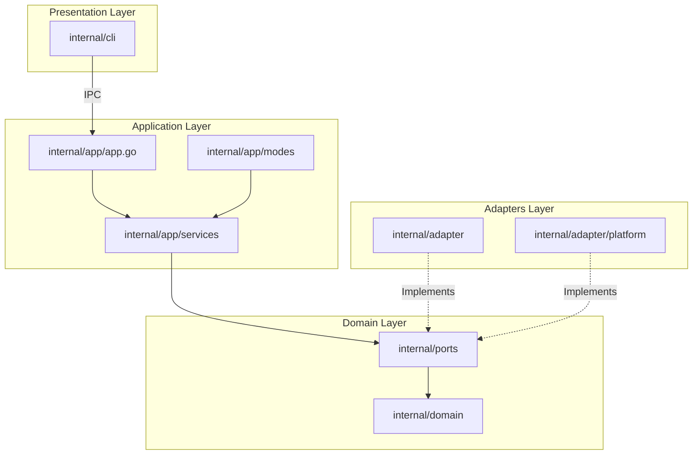
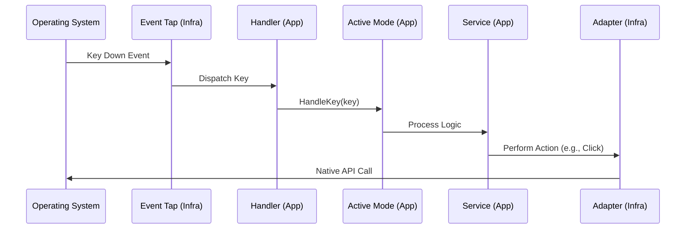
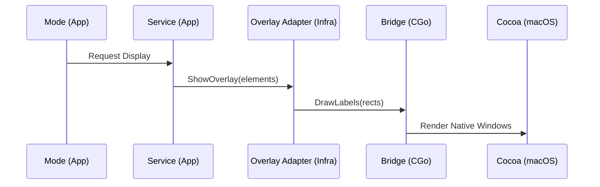

# Architecture

How Neru is structured internally: layers, boundaries, data flow, and the rules
that keep platform code isolated.

Neru is a keyboard-driven navigation tool written in Go with an Objective-C
bridge on macOS. It runs as a daemon with a thin CLI client.

This document owns **system shape and rationale**. What actually works on each
platform lives in [CROSS_PLATFORM.md](CROSS_PLATFORM.md); how to build and test
lives in [DEVELOPMENT.md](DEVELOPMENT.md).

**Related:** [Cross-Platform Guide](CROSS_PLATFORM.md) ·
[Development Guide](DEVELOPMENT.md) · [Agent Guide](../AGENTS.md)

---

## Table of Contents

- [System Overview](#system-overview)
- [Runtime Shape](#runtime-shape)
- [Design Principles](#design-principles)
- [The "One Rule"](#the-one-rule)
- [Component Architecture](#component-architecture)
- [Codebase Navigation Guide](#codebase-navigation-guide)
- [Data Flow](#data-flow)
- [Mode Handler Locking](#mode-handler-locking)
- [Coordinate Systems and Units](#coordinate-systems-and-units)
- [Error Handling and Graceful Degradation](#error-handling-and-graceful-degradation)
- [Runtime Capability Reporting](#runtime-capability-reporting)
- [Platform Boundaries in the CLI Layer](#platform-boundaries-in-the-cli-layer)
- [Application Identifier Terminology](#application-identifier-terminology)
- [Technology Stack](#technology-stack)
- [Performance Considerations](#performance-considerations)
- [Security Architecture](#security-architecture)
- [References](#references)

---

## System Overview

Neru runs as a background daemon that listens for global hotkeys and keyboard
events. When activated it offers several navigation modes:

- **Hints** — overlays unique character labels on clickable UI elements
- **Grid** — divides the screen into a coordinate-based grid
- **Recursive grid** — recursive cell navigation with center preview and backtracking
- **Scroll** — Vim-style scrolling at the cursor position

The architecture targets low latency and cross-platform extensibility while
integrating deeply with native APIs. macOS is the reference implementation;
current per-platform support is tracked in
[CROSS_PLATFORM.md](CROSS_PLATFORM.md#platform-status).

---

## Runtime Shape

Neru is a **daemon plus a thin CLI**. `neru launch` starts the daemon;
`neru hints`, `neru action left_click`, `neru config reload` and friends dial a
Unix domain socket or a Windows named pipe — see `internal/adapter/ipc` for the
transport and
`internal/app/ipcctrl` for the command handlers.

The endpoint is scoped to one user, in where it lives and in what the daemon
checks before serving a connection:

- **Unix socket** — `$XDG_RUNTIME_DIR/neru/neru.sock` where the session
  provides a runtime directory, otherwise `$TMPDIR/neru-<uid>/neru.sock`, mode
  0600 inside a directory the daemon creates 0700 and owns. The daemon then
  reads the connecting process's uid from the kernel and serves only its own.
- **Named pipe** — `\\.\pipe\neru-<SID>`, created with a protected DACL naming
  that SID alone. There the kernel checks the descriptor before the connection
  is ever accepted, which is the same question asked earlier.

`neru doctor` prints the endpoint in use. What each *client* can establish
about the daemon before it connects differs by platform, and is a
[Known Gap](CROSS_PLATFORM.md#known-gaps) rather than part of this shape.

New user-facing behavior therefore usually needs three pieces: a CLI command
(`internal/cli/`, registered in an `init()`), an IPC handler, and the
service/mode work behind it.

Startup is a numbered, individually-unwound phase sequence in
[new.go](../internal/app/new.go), with the
individual steps in
[startup_phases.go](../internal/app/startup_phases.go):

```
1. infrastructure    4. UI components      7. IPC controller
2. services          4.5 systray           8. event tap + IPC server
3. application state 5. render components  9. shutdown channel
                     6. mode handler
```

Dependency injection is manual and explicit. Each phase that allocates
something appends a cleanup closure; on failure the app records `failurePhase`
and runs those closures in reverse (`slices.Backward`), so a half-built daemon
never lingers.

---

## Design Principles

Neru follows a layered **Hexagonal Architecture (Ports and Adapters)**:

1. **Shared business logic** — hint generation, grid calculations, mode
   transitions are pure Go in `internal/domain` and `internal/app/services`.
2. **Platform isolation** — OS-specific code is strictly quarantined.
3. **Ports and adapters** — every system capability (Accessibility, Hotkeys,
   Overlays) is an interface in `internal/ports`, implemented by an adapter
   in `internal/adapter`.
4. **Build tag separation** — OS-specific files carry build tags (`//go:build
   darwin`) so they compile only for their target.
5. **Platform roles over brand names** — shared code says "primary modifier",
   "display server", "accessibility backend", never `Cmd` or a single display
   stack.
6. **Build strategy follows backend choice** — CGO is a per-backend-family
   decision, not a per-OS one. macOS requires it; Linux and Windows mix pure-Go
   and CGO-backed implementations by subsystem.

Where platform code physically goes, which file slot to use, and how the Linux
backend family is organized are contributor concerns owned by
[CROSS_PLATFORM.md](CROSS_PLATFORM.md#contributor-guide). The architectural
source of truth for per-subsystem backend family, primary-modifier
expectations, and build mode is
[profile.go](../internal/adapter/platform/profile.go).

---

## The "One Rule"

> **Non-darwin-tagged code must never import
> `internal/adapter/platform/darwin`.**

Enforced twice: `depguard` in `.golangci.yml`, and
[dependency_boundary_test.go](../internal/architecture/dependency_boundary_test.go).
The duplication is deliberate. `depguard` matches directories, so its exemption
for a darwin-only package is sound only while every file in such a directory
carries the build tag that makes it darwin-only — and what checks that is
`TestPlatformPackagesTagEveryFile`, a Go test with no lint equivalent. The test
is the primary enforcement; the lint rule is the fast feedback.

Both exempt the same three shapes, and they are shapes rather than a list of
packages: any file under a directory named `darwin`, any `*_darwin.go`, and any
`*integration_darwin_test.go`. A new darwin backend package needs no edit to
either.

Cross the boundary through `ports.SystemPort` or a build-tagged dispatch pair
(`platform_darwin.go` / `platform_other.go`).

---

## Component Architecture


```mermaid
graph TD
    subgraph "Presentation Layer"
        CLI[internal/cli]
    end

    subgraph "Application Layer"
        App[internal/app/app.go]
        Modes[internal/app/modes]
        Services[internal/app/services]
    end

    subgraph "Domain Layer"
        Ports[internal/ports]
        Domain[internal/domain]
    end

    subgraph "Adapters Layer"
        Adapters[internal/adapter]
        Platform[internal/adapter/platform]
    end

    CLI -->|IPC| App
    App --> Services
    Modes --> Services
    Services --> Ports
    Ports --> Domain
    Adapters -.->|Implements| Ports
    Platform -.->|Implements| Ports
```

### Layer responsibilities

- **Domain** (`internal/domain`) — pure business logic and entities
  ([hint.go](../internal/domain/hint/hint.go),
  [grid.go](../internal/domain/grid/grid.go)). No external dependencies.
- **Ports** (`internal/ports`) — interface contracts defining system
  capabilities ([accessibility.go](../internal/ports/accessibility.go),
  [overlay.go](../internal/ports/overlay.go),
  [font.go](../internal/ports/font.go)).
- **Application** (`internal/app`) — orchestrates domain entities and services;
  owns lifecycle and navigation modes.
- **Adapters** (`internal/adapter`) — concrete port implementations on
  platform APIs.
- **Overlay** (`internal/adapter/overlay`) — the adapter behind
  `ports.OverlayPort`: it resolves styles, builds its own render components and
  owns the sequence a mode transition needs. A mode hands it a Frame; pure
  coordinate math lives in `internal/domain/geometry`.
- **CLI** (`internal/cli`) — user commands, config loading, IPC to the daemon.

A directory-by-directory map for placing new code is in
[DEVELOPMENT.md](DEVELOPMENT.md#where-things-go).

---

## Codebase Navigation Guide

The fastest way to understand Neru is to follow one event from the OS to the
user-visible action.

**1. Entry points**

- [main_darwin.go](../cmd/neru/main_darwin.go) — bootstraps the app, locking the
  main thread for Cocoa
- [root.go](../internal/cli/root.go) — the Cobra root command

**2. Application wiring**

- [new.go](../internal/app/new.go) — startup phases
- [startup_phases.go](../internal/app/startup_phases.go) —
  the individual infrastructure, service, and UI steps

**3. The platform factory**

[factory.go](../internal/adapter/platform/factory.go) and its build-tagged
siblings are the only place that picks a `ports.SystemPort` implementation. On
Linux there is a second, *runtime* axis on top of build tags:
[backend_linux.go](../internal/adapter/platform/backend_linux.go) detects the
live compositor (wlroots / KDE / GNOME / other) and the factory routes to it.

**4. Where a platform's code lives**

Each OS capability is a package under `internal/adapter/`. Where a backend is a
real implementation rather than a few dispatch functions, it gets its own
directory and the directory names the platform:

```
adapter/eventtap/{tap,darwin,linux,windows}          keyboard capture
adapter/hotkeys/{darwin,linux,windows}               global hotkeys
adapter/systray/{darwin,linux,windows}               tray icon
adapter/accessibility/{ax,atspi,native}              element discovery
adapter/overlay/{manager,darwin,linux,windows}       overlay rendering
adapter/platform/{darwin,linux,windows}              the native cgo bridges
```

The parent package holds the port adapter and a small build-tagged factory —
the only place that knows which implementation exists. So "what do I touch to
add a compositor?" is answered by `ls`, not by reading build tags. When a
backend earns its own package and when build-tagged files in one package are
clearer is covered in
[CROSS_PLATFORM.md](CROSS_PLATFORM.md#backend-packages).

**5. Input processing**

1. **OS** — [eventtap_darwin.m](../internal/adapter/platform/darwin/eventtap_darwin.m)
   captures low-level keyboard events (Linux/Windows have equivalents)
2. **Adapters** — [adapter.go](../internal/adapter/eventtap/adapter.go)
   receives and dispatches them
3. **Application** — [handler.go](../internal/app/modes/handler.go) routes the
   key to the active [Mode](../internal/app/modes/base.go)
4. **Service** — the mode calls into
   [hint_service.go](../internal/app/services/hint_service.go) and friends
5. **Keyboard layout changes** — on macOS the mode-level CGEventTap rebuilds its
   key-name lookup tables at runtime (`NeruSetKeymapLayoutChangeCallback` in
   [keymap_darwin.m](../internal/adapter/platform/darwin/keymap_darwin.m)) so
   navigation keys survive layout switches. Per-hotkey CGEventTaps re-register
   too (`NeruSetKeymapLayoutChangeCallback2`), because `NeruKeyNameToCode` maps
   key names to layout-aware keycodes.

---

## Data Flow

### Input event propagation


```mermaid
sequenceDiagram
    participant OS as Operating System
    participant ET as Event Tap (Infra)
    participant H as Handler (App)
    participant M as Active Mode (App)
    participant S as Service (App)
    participant A as Adapter (Infra)

    OS->>ET: Key Down Event
    ET->>H: Dispatch Key
    H->>M: HandleKey(key)
    M->>S: Process Logic
    S->>A: Perform Action (e.g., Click)
    A->>OS: Native API Call
```

### Overlay rendering


```mermaid
sequenceDiagram
    participant M as Mode (App)
    participant S as Service (App)
    participant OA as Overlay Adapter (Infra)
    participant B as Bridge (CGo)
    participant C as Cocoa (macOS)

    M->>S: Request Display
    S->>OA: ShowOverlay(elements)
    OA->>B: DrawLabels(rects)
    B->>C: Render Native Windows
```

On macOS each component owns its own NSPanel and calls the Objective-C bridge
directly. On Linux and Windows the overlay **manager** does all drawing into one
shared surface, and the per-component files are style-only stubs — see
[CROSS_PLATFORM.md](CROSS_PLATFORM.md#overlay-rendering).

### The CGo bridge (macOS)

Native macOS classes are wrapped in CGo so Go can call Cocoa while keeping type
safety. Location: `internal/adapter/platform/darwin/`; key files `bridge.go`,
`overlay_darwin.m`, `accessibility_element_darwin.m`.

---

## Mode Handler Locking

`modes.Handler` is split so the compiler enforces its locking discipline, and
`Mode.Activate` / `HandleKey` / `Exit` all run with the lock already held. The
full contract — the `Handler` / `handlerState` split, the `outer` escape hatch
for deferred callbacks, and the `moveMonitorMu` → `h.mu` lock order — lives in
[internal/app/modes/AGENTS.md](../internal/app/modes/AGENTS.md). Read it before
touching modes or anything that calls back into the handler.

---

## Coordinate Systems and Units

All shared code uses a **global top-left (0,0)** coordinate system.

- **Origin** — (0,0) is the top-left corner of the primary display
- **Y-axis** — increases downwards
- **Units** — screen pixels, unscaled

macOS Cocoa uses a bottom-left origin with Y increasing upwards. The inversion
happens inside the darwin adapter, open-coded at each site that needs it
([accessibility_screen_darwin.m](../internal/adapter/platform/darwin/accessibility_screen_darwin.m)
is one of several) — flipped coordinates must never leak into shared Go, which
is the property the rule buys and the code has. `internal/domain/geometry` is
not where a flip lives: it translates origins, rescales and clamps, every
function is sign-preserving in Y, and Linux imports it too.

---

## Error Handling and Graceful Degradation

Neru uses the custom [derrors](../internal/derrors/errors.go) package:
`derrors.New(code, msg)` and `derrors.Wrap(err, code, msg)`.

### The `CodeNotSupported` policy

Unimplemented platform behavior must return `CodeNotSupported` explicitly rather
than silently no-oping:

```go
return derrors.New(derrors.CodeNotSupported, "feature X not yet implemented on linux")
```

Callers in the service layer degrade gracefully via `derrors.IsNotSupported(err)`
— typically logging a warning instead of surfacing an error. Prefer
`CodeNotSupported` over a silent no-op unless the operation is explicitly
documented as best-effort.

---

## Runtime Capability Reporting

Adapters report a capability matrix stricter than "it compiles": `supported`
vs `stub`, surfaced to users by `neru doctor`. The registry
([capabilities.go](../internal/ports/capabilities.go),
[capability_presets.go](../internal/ports/capability_presets.go)) must stay in
sync with reality; the policy and per-platform status live in
[CROSS_PLATFORM.md](CROSS_PLATFORM.md#capability-matrix).

---

## Platform Boundaries in the CLI Layer

**`neru services`** — the command itself is shared:
[services.go](../internal/cli/services.go) registers `ServicesCmd`
unconditionally and delegates to unexported helpers (`installService`,
`startService`, …). The helpers are a Tier-2 dispatch set:
[services_darwin.go](../internal/cli/services_darwin.go) (`//go:build darwin`)
drives `launchctl` and `.plist` files,
[services_linux.go](../internal/cli/services_linux.go) (`//go:build linux`)
drives `systemctl --user` and a unit file,
[services_windows.go](../internal/cli/services_windows.go)
(`//go:build windows`) drives the Task Scheduler COM API with an XML task
definition, and [services_other.go](../internal/cli/services_other.go)
(`//go:build !darwin && !linux && !windows`) returns `CodeNotSupported`.
Registration is shared, so a platform joining the set adds one file and no
`init()`.

**`IsRunningFromAppBundle`** — [root.go](../internal/cli/root.go) delegates to
a build-tagged implementation: [root_darwin.go](../internal/cli/root_darwin.go)
detects `.app/Contents/MacOS` paths so the daemon auto-starts when
double-clicked in Finder, [root_windows.go](../internal/cli/root_windows.go)
detects launches from Explorer / the Start Menu, and
[root_other.go](../internal/cli/root_other.go) returns false.

**Main-thread locking** — on macOS
[main_darwin.go](../cmd/neru/main_darwin.go) calls `runtime.LockOSThread()`
before anything else, required by Cocoa. Non-macOS builds omit it. Never add
`LockOSThread` to shared code.

---

## Application Identifier Terminology

The codebase says "bundle ID" generically for the platform application
identifier:

| Platform | Term                        | Example                          |
| -------- | --------------------------- | -------------------------------- |
| macOS    | Bundle ID                   | `com.apple.Safari`               |
| Linux    | Desktop ID / executable     | `firefox.desktop` or `firefox`   |
| Windows  | AppUserModelID / executable | `Microsoft.Edge` or `msedge.exe` |

`ports.AccessibilityPort.FocusedAppBundleID` returns whatever the platform uses,
and `general.excluded_apps` in the config should use the same format for the
target platform.

---

## Technology Stack

- **Core language** — [Go](https://golang.org/) 1.26+
- **Native integration** — [CGo](https://pkg.go.dev/cmd/cgo) + Objective-C (macOS)
- **CLI framework** — [Cobra](https://github.com/spf13/cobra)
- **Configuration** — [TOML](https://toml.io/)
- **IPC** — Unix domain sockets (Windows named pipes)
- **Build system** — [Just](https://github.com/casey/just)
- **CI/CD** — GitHub Actions + [Release Please](https://github.com/googleapis/release-please)

GitHub Actions runs lint, unit, and integration tests on every PR. Windows
binaries cross-compile with `CGO_ENABLED=0`; Linux builds need `CGO_ENABLED=1`
(X11/Wayland native backends) and must run on a Linux host, as macOS does for
its own.

---

## Performance Considerations

1. **Event tap latency** — the event tap callback stays extremely lean to avoid
   system-wide keyboard lag; heavy processing is deferred to goroutines.
2. **Bounded accessibility walks** — querying accessibility APIs is expensive, so
   traversal is bounded rather than exhaustive: `maxDepth` on the macOS walk
   ([ax.go](../internal/adapter/accessibility/ax/ax.go)), and
   `atspiMaxDepth` / `atspiMaxNodes` on the Linux AT-SPI walk
   ([atspi/client.go](../internal/adapter/accessibility/atspi/client.go)).
3. **Caching** — a TTL/LRU cache for computed grid layouts
   ([grid/cache.go](../internal/domain/grid/cache.go)) and a cache of C
   string pointers for overlay styles
   ([style_cache.go](../internal/adapter/overlay/render/overlayutil/style_cache.go))
   keep repeated activations off the hot path.
4. **Native rendering** — GPU-accelerated CoreAnimation on macOS, Cairo on
   Linux, Direct2D on a DirectComposition swapchain on Windows (GDI on a
   layered window where that cannot come up). The Windows draw queues
   commands and returns; a dedicated UI thread paints and presents them,
   coalescing frames, so no keystroke waits on pixels.

---

## Security Architecture

1. **Secure input detection** — Neru detects when Secure Input is enabled (e.g.
   a focused password field) and suspends the event tap, preventing unintended
   key logging.
2. **Permissions** — Accessibility permission is required on macOS; Neru requests
   only the minimum needed for UI interaction.
3. **IPC security** — the endpoint is scoped to one user, and the daemon checks
   that for itself rather than trusting the scoping; see Runtime Shape above,
   which owns the detail.

---

## References

- [CROSS_PLATFORM.md](CROSS_PLATFORM.md) — per-platform support and contributor guide
- [DEVELOPMENT.md](DEVELOPMENT.md) — build, test, debug, add code
- [CONFIGURATION.md](CONFIGURATION.md) — configuration reference
- [macOS Accessibility API](https://developer.apple.com/documentation/applicationservices/ax_ui_element_ref)
