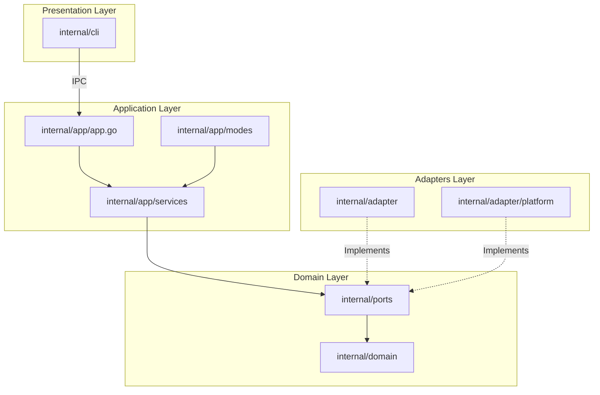
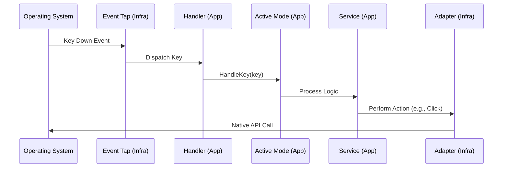
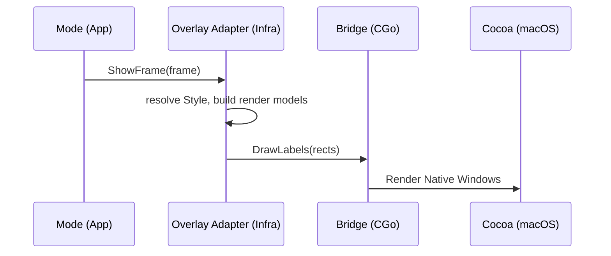

# Architecture

How Neru is structured internally: layers, boundaries, data flow, and the rules
that keep platform code isolated. This page covers shape and rationale. What
works on each platform is in [platform support](../reference/platform-support.md),
where platform code goes is in the [porting guide](porting.md), and how to
build and test is in the [development guide](development.md).

## System overview

Neru is a keyboard-driven navigation tool written in Go, with an Objective-C
bridge on macOS. It runs as a background daemon that listens for global
hotkeys and keyboard events. When activated it offers several navigation modes:

- **Hints** put unique character labels on clickable UI elements
- **Grid** divides the screen into a coordinate-based grid
- **Recursive grid** narrows into cells, with center preview and backtracking
- **Scroll** scrolls Vim-style at the cursor position
- **Monitor select** labels each display so the cursor can jump between them
- **Custom modes** are user-declared in `[modes.<name>]` and entered with
  `neru mode <name>`

The design aims for low latency, room for more platforms, and direct use of
native APIs. macOS is the reference implementation.

## Runtime shape

Neru is a **daemon plus a thin CLI**. `neru launch` starts the daemon.
`neru hints`, `neru action left_click`, `neru config reload` and the other
commands dial a Unix domain socket or a Windows named pipe. The transport is in
`internal/adapter/ipc` and the command handlers in `internal/app/ipcctrl`.

The endpoint is scoped to one user, both in where it lives and in what the
daemon checks before serving a connection:

- **Unix socket**: `$XDG_RUNTIME_DIR/neru/neru.sock` where the session
  provides a runtime directory, otherwise `$TMPDIR/neru-<uid>/neru.sock`, mode
  0600 inside a directory the daemon creates 0700 and owns. The daemon then
  reads the connecting process's uid from the kernel and serves only its own.
- **Named pipe**: `\\.\pipe\neru-<SID>`, created with a protected DACL naming
  that SID alone. There the kernel checks the descriptor before it accepts the
  connection, so the same ownership check happens earlier.

`neru doctor` prints the endpoint in use. On every platform the client also
confirms, before sending anything, that the process serving the endpoint runs
as this user.

New user-facing behavior therefore usually needs three pieces: a CLI command
(`internal/cli/`, registered in an `init()`), an IPC handler, and the
service or mode work behind it.

Startup is a numbered, individually-unwound phase sequence in
[new.go](../../internal/app/new.go), with the individual steps in
[startup_phases.go](../../internal/app/startup_phases.go):

```text
1. infrastructure    4. UI components      7. IPC controller
2. services          4.5 systray           8. event tap + IPC server
3. application state 5. render components  9. shutdown channel
                     6. mode handler
```

Dependency injection is manual and explicit. Each phase that allocates
something appends a cleanup closure. On failure the app records `failurePhase`
and runs those closures in reverse (`slices.Backward`), so a half-built daemon
never keeps running.

## Design principles

Neru follows a layered **Hexagonal Architecture (Ports and Adapters)**:

1. **Shared business logic**: hint generation, grid calculations and mode
   transitions are pure Go in `internal/domain` and `internal/app/services`.
2. **Platform isolation**: OS-specific code stays out of shared code.
3. **Ports and adapters**: every system capability (Accessibility, Hotkeys,
   Overlays) is an interface in `internal/ports`, implemented by an adapter
   in `internal/adapter`.
4. **Build tag separation**: OS-specific files carry build tags (`//go:build
   darwin`) so they compile only for their target.
5. **Platform roles over brand names**: shared code says "primary modifier",
   "display server", "accessibility backend", never `Cmd` or a single display
   stack.
6. **Build strategy follows backend choice**: CGO is a per-backend-family
   decision, not a per-OS one. See [CGO guidance](porting.md#cgo-guidance).

The source of truth for per-subsystem backend family, primary-modifier
expectations and build mode is
[profile.go](../../internal/adapter/platform/profile.go).

## The "One Rule"

> **Non-darwin-tagged code must never import
> `internal/adapter/platform/darwin`.**

Enforced twice: `depguard` in `.golangci.yml`, and
[dependency_boundary_test.go](../../internal/architecture/dependency_boundary_test.go).
The duplication is deliberate. `depguard` matches directories, so its exemption
for a darwin-only package is sound only while every file in such a directory
carries the build tag that makes it darwin-only. What checks that is
`TestPlatformPackagesTagEveryFile`, a Go test with no lint equivalent. The test
is the primary enforcement and the lint rule is the fast feedback.

Both exempt the same three shapes, and they are shapes rather than a list of
packages: any file under a directory named `darwin`, any `*_darwin.go`, and any
`*integration_darwin_test.go`. A new darwin backend package needs no edit to
either.

Cross the boundary through `ports.SystemPort` or a build-tagged dispatch pair
(`platform_darwin.go` / `platform_other.go`).

## Component architecture



### Layer responsibilities

- **Domain** (`internal/domain`): pure business logic and entities
  ([hint.go](../../internal/domain/hint/hint.go),
  [grid.go](../../internal/domain/grid/grid.go)). No external dependencies.
- **Ports** (`internal/ports`): interface contracts defining system
  capabilities ([accessibility.go](../../internal/ports/accessibility.go),
  [overlay.go](../../internal/ports/overlay.go),
  [font.go](../../internal/ports/font.go)).
- **Application** (`internal/app`): orchestrates domain entities and services,
  and owns lifecycle and navigation modes.
- **Adapters** (`internal/adapter`): concrete port implementations on
  platform APIs.
- **Overlay** (`internal/adapter/overlay`): the adapter behind
  `ports.OverlayPort`. It resolves styles, builds its own render components and
  owns the sequence a mode transition needs. A mode hands it a Frame. Pure
  coordinate math lives in `internal/domain/geometry`.
- **CLI** (`internal/cli`): user commands, config loading, IPC to the daemon.

A directory-by-directory map for placing new code is in
[Where things go](development.md#where-things-go).

## Codebase navigation guide

The fastest way to understand Neru is to follow one event from the OS to the
user-visible action.

**1. Entry points**

- [main_darwin.go](../../cmd/neru/main_darwin.go) bootstraps the app, locking
  the main thread for Cocoa
- [root.go](../../internal/cli/root.go) is the Cobra root command

**2. Application wiring**

- [new.go](../../internal/app/new.go): startup phases
- [startup_phases.go](../../internal/app/startup_phases.go): the individual
  infrastructure, service and UI steps

**3. The platform factory**

[factory.go](../../internal/adapter/platform/factory.go) and its build-tagged
siblings are the only place that picks a `ports.SystemPort` implementation. On
Linux there is a second, runtime axis on top of build tags.
[backend_linux.go](../../internal/adapter/platform/backend_linux.go) detects the
live compositor (wlroots, KDE, GNOME, other) and the factory routes to it.

**4. Where a platform's code lives**

Each OS capability is a package under `internal/adapter/`, with one directory
per platform where the backend is a real implementation. The layout, and when a
backend gets its own package, are in
[Backend packages](porting.md#backend-packages).

**5. Input processing**

1. **OS**: [eventtap_darwin.m](../../internal/adapter/platform/darwin/eventtap_darwin.m)
   captures low-level keyboard events (Linux and Windows have equivalents)
2. **Adapters**: [adapter.go](../../internal/adapter/eventtap/adapter.go)
   receives and dispatches them
3. **Application**: [handler.go](../../internal/app/modes/handler.go) routes the
   key to the active [Mode](../../internal/app/modes/base.go). A held direction
   key in the held-key glide is the one exception. The handler and the global
   hotkey binder both pass it to
   [heldmotion](../../internal/app/heldmotion/controller.go), whose fixed-rate
   loop integrates the held set into cursor moves and posts them straight to
   the system port, never through a mode
4. **Service**: the mode calls into
   [hint_service.go](../../internal/app/services/hint_service.go) and its
   siblings
5. **Keyboard layout changes**: on macOS the mode-level CGEventTap rebuilds its
   key-name lookup tables at runtime (`NeruSetKeymapLayoutChangeCallback` in
   [keymap_darwin.m](../../internal/adapter/platform/darwin/keymap_darwin.m)) so
   navigation keys keep working after a layout switch. Per-hotkey CGEventTaps re-register
   too (`NeruSetKeymapLayoutChangeCallback2`), because `NeruKeyNameToCode` maps
   key names to layout-aware keycodes.

## Data flow

### Input event propagation



### Overlay rendering



A mode hands the overlay adapter a `ports.Frame` of domain values and nothing
else. Resolving styles and running the show, switch and draw sequence is the
adapter's job (`internal/adapter/overlay/AGENTS.md`). Services never touch the
overlay.

On macOS each component owns its own NSPanel and calls the Objective-C bridge
directly. On Linux and Windows the overlay manager does all drawing into one
shared surface, and the per-component files are style-only stubs.

### The CGo bridge (macOS)

Native macOS classes are wrapped in CGo so Go can call Cocoa while keeping type
safety. They live in `internal/adapter/platform/darwin/`, with `bridge.go`,
`overlay_darwin.m` and `accessibility_element_darwin.m` as the key files. Style
rules for that code are in [Objective-C guidelines](objective-c.md).

## Mode handler locking

`modes.Handler` is split so the compiler enforces its locking discipline, and
`Mode.Activate`, `HandleKey` and `Exit` all run with the lock already held. The
full contract (the `Handler` / `handlerState` split, the `outer` escape hatch
for deferred callbacks, and the `moveMonitorMu` then `h.mu` lock order) lives in
[internal/app/modes/AGENTS.md](../../internal/app/modes/AGENTS.md). Read it
before touching modes or anything that calls back into the handler.

## Coordinate systems and units

All shared code uses a **global top-left (0,0)** coordinate system.

- **Origin**: (0,0) is the top-left corner of the primary display
- **Y-axis**: increases downwards
- **Units**: screen pixels, unscaled

macOS Cocoa uses a bottom-left origin with Y increasing upwards. The inversion
happens inside the darwin adapter, open-coded at each site that needs it
([accessibility_screen_darwin.m](../../internal/adapter/platform/darwin/accessibility_screen_darwin.m)
is one of several). Flipped coordinates must never leak into shared Go.
`internal/domain/geometry` is not where a flip lives. It translates origins,
rescales and clamps, every function is sign-preserving in Y, and Linux imports
it too.

## Error handling and graceful degradation

Neru uses the [derrors](../../internal/derrors/errors.go) package:
`derrors.New(code, msg)` and `derrors.Wrap(err, code, msg)`.

### The `CodeNotSupported` policy

Unimplemented platform behavior must return `CodeNotSupported` explicitly rather
than silently doing nothing:

```go
return derrors.New(derrors.CodeNotSupported, "ScreenBounds not yet implemented on linux")
```

Name the missing operation and the platform in the message. Callers in the
service layer degrade gracefully via `derrors.IsNotSupported(err)`, typically
logging a warning instead of surfacing an error. A silent no-op is acceptable
only when the operation is explicitly documented as best-effort.

## Runtime capability reporting

Adapters report a capability matrix stricter than "it compiles": `supported`
or `stub`, surfaced to users by `neru doctor`. The registry
([capabilities.go](../../internal/ports/capabilities.go),
[capability_presets.go](../../internal/ports/capability_presets.go)) must match
what the code does. A stub must report `stub`, and a shipped feature must stop
reporting it. How to register a new capability is in
[Adding a capability to neru doctor](porting.md#adding-a-capability-to-neru-doctor).
What each platform reports today is in the
[capability matrix](../reference/platform-support.md#capability-matrix).

## Platform boundaries in the CLI layer

**`neru services`**: the command itself is shared.
[services.go](../../internal/cli/services.go) registers `ServicesCmd`
unconditionally and delegates to unexported helpers (`installService`,
`startService` and others). The helpers are a Tier-2 dispatch set:
[services_darwin.go](../../internal/cli/services_darwin.go) drives `launchctl`
and `.plist` files,
[services_linux.go](../../internal/cli/services_linux.go) drives
`systemctl --user` and a unit file,
[services_windows.go](../../internal/cli/services_windows.go) drives the Task
Scheduler COM API with an XML task definition, and
[services_other.go](../../internal/cli/services_other.go) returns
`CodeNotSupported`. Registration is shared, so a platform joining the set adds
one file and no `init()`.

**`IsRunningFromAppBundle`**: [root.go](../../internal/cli/root.go) delegates to
a build-tagged implementation. [root_darwin.go](../../internal/cli/root_darwin.go)
detects `.app/Contents/MacOS` paths so the daemon auto-starts when
double-clicked in Finder, [root_windows.go](../../internal/cli/root_windows.go)
detects launches from Explorer or the Start Menu, and
[root_other.go](../../internal/cli/root_other.go) returns false.

**Main-thread locking**: on macOS
[main_darwin.go](../../cmd/neru/main_darwin.go) calls `runtime.LockOSThread()`
before anything else, as Cocoa requires. Non-macOS builds omit it. Never add
`LockOSThread` to shared code.

## Application identifier terminology

The codebase says "bundle ID" generically for the platform application
identifier:

| Platform | Term                                  | Example                           |
| -------- | ------------------------------------- | --------------------------------- |
| macOS    | Bundle ID                             | `com.apple.Safari`                |
| Linux    | `WM_CLASS` (X11) / `app_id` (Wayland) | `firefox`                         |
| Windows  | Process image path                    | `C:\Program Files\...\msedge.exe` |

`ports.AccessibilityPort.FocusedAppBundleID` returns whatever the platform uses,
and `general.excluded_apps` matches it by exact string, so the config must use
the same format for the target platform.

## Technology stack

- **Core language**: [Go](https://golang.org/)
- **Native integration**: [CGo](https://pkg.go.dev/cmd/cgo), Objective-C on
  macOS, C on Linux, pure Go Win32 bindings on Windows
- **CLI framework**: [Cobra](https://github.com/spf13/cobra)
- **Configuration**: [TOML](https://toml.io/)
- **IPC**: Unix domain sockets, Windows named pipes
- **Build system**: [Just](https://github.com/casey/just)
- **CI/CD**: GitHub Actions and
  [Release Please](https://github.com/googleapis/release-please)

## Performance considerations

1. **Event tap latency**: the event tap callback does as little as possible, to
   avoid system-wide keyboard lag. Heavy processing runs in goroutines.
2. **Bounded accessibility walks**: querying accessibility APIs is expensive, so
   traversal is bounded rather than exhaustive. The macOS walk has `maxDepth`
   ([ax.go](../../internal/adapter/accessibility/ax/ax.go)), and the Linux
   AT-SPI walk has `atspiMaxDepth` and `atspiMaxNodes`
   ([atspi/client.go](../../internal/adapter/accessibility/atspi/client.go)).
3. **Caching**: a TTL/LRU cache for computed grid layouts
   ([grid/cache.go](../../internal/domain/grid/cache.go)) and a cache of C
   string pointers for overlay styles
   ([style_cache.go](../../internal/adapter/overlay/render/overlayutil/style_cache.go))
   save recomputing them on repeated activations.
4. **Native rendering**: GPU-accelerated CoreAnimation on macOS, Cairo on
   Linux, and Direct2D on a DirectComposition swapchain on Windows (GDI on a
   layered window where that cannot start). The Windows draw queues commands
   and returns. A dedicated UI thread paints and presents them, coalescing
   frames, so no keystroke waits for a paint. Between draws that thread waits on
   the Win32 message queue, and queued Go callbacks post a native wakeup, so
   Windows messages are serviced even when the overlay is idle.

## Security architecture

1. **Secure input detection**: before activating hints, grid, recursive grid
   or monitor select, the handler asks the system port whether secure input is
   engaged (for example a focused password field). If so it refuses with
   `CodeSecureInputEnabled` and notifies the user. Scroll and user-declared
   modes do not run that check.
2. **Permissions**: Neru requests only the OS permissions it needs for UI
   interaction.
3. **IPC security**: the endpoint is scoped to one user, and the daemon checks
   that for itself rather than trusting the scoping. [Runtime shape](#runtime-shape)
   has the detail.
