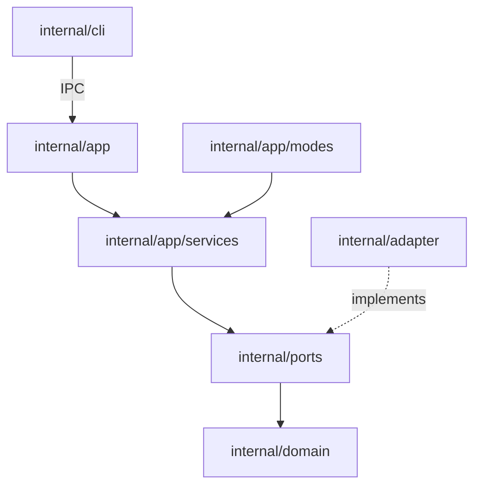

# Architecture

Neru's layers, boundaries and data flow. Per-platform status is in
[platform support](../reference/platform-support.md), and where platform code
goes is in the [porting guide](porting.md). macOS is the reference
implementation.

## Runtime shape

Neru is a **daemon plus a thin CLI**. `neru launch` starts the daemon. The
other commands (`neru hints`, `neru action left_click`, `neru config reload`)
dial a Unix domain socket or a Windows named pipe. The transport is in
`internal/adapter/ipc` and the command handlers in `internal/app/ipcctrl`.

The endpoint is scoped to one user, in where it lives and in what the daemon
checks before serving a connection:

- **Unix socket**: `$XDG_RUNTIME_DIR/neru/neru.sock` if the session provides a
  runtime directory, otherwise `$TMPDIR/neru-<uid>/neru.sock`. The socket is
  mode 0600 inside a 0700 directory the daemon creates and owns. The daemon
  reads the connecting process's uid from the kernel and serves only its own.
- **Named pipe**: `\\.\pipe\neru-<SID>`, created with a protected DACL naming
  that SID alone, so the kernel checks ownership before it accepts the
  connection.

On every platform the client also confirms that the process serving the
endpoint runs as the same user before sending anything. `neru doctor` prints
the endpoint in use. New user-facing behavior usually needs a CLI command
(`internal/cli/`, registered in an `init()`), an IPC handler, and the service
or mode work behind it.

Startup is a numbered phase sequence in [new.go](../../internal/app/new.go),
with the steps in [startup_phases.go](../../internal/app/startup_phases.go):

```text
1. infrastructure    4. UI components      7. IPC controller
2. services          4.5 systray           8. event tap + IPC server
3. application state 5. render components  9. shutdown channel
                     6. mode handler
```

Each phase that allocates something appends a cleanup closure. On failure the
app records `failurePhase` and runs the closures in reverse
(`slices.Backward`), so a half-built daemon never keeps running.

## Design principles

Neru uses **hexagonal architecture (ports and adapters)**:

1. Domain logic and services are pure Go (`internal/domain`,
   `internal/app/services`).
2. Every system capability is an interface in `internal/ports`, implemented in
   `internal/adapter`. OS-specific files carry build tags.
3. Shared code names platform roles ("primary modifier", "display server"),
   never `Cmd` or one display stack.
4. CGO is a per-backend decision
   ([CGO guidance](porting.md#cgo-guidance)), and
   [profile.go](../../internal/adapter/platform/profile.go) records each
   subsystem's backend family, primary modifier and build mode.

## The "One Rule"

> **Non-darwin-tagged code must never import
> `internal/adapter/platform/darwin`.**

[dependency_boundary_test.go](../../internal/architecture/dependency_boundary_test.go)
is the primary enforcement, and `depguard` in `.golangci.yml` gives fast
feedback. `depguard` matches directories, so its exemption holds only while
every file in a darwin-only directory carries the darwin tag, which
`TestPlatformPackagesTagEveryFile` checks
([ADR 0011](../adr/0011-a-contract-earns-a-guardrail-when-its-breach-is-silent.md)).
Both exempt three shapes: any file under a directory named `darwin`, any
`*_darwin.go`, and any `*integration_darwin_test.go`. A new darwin backend
package needs no edit to either.

Cross the boundary through `ports.SystemPort` or a build-tagged dispatch pair
(`platform_darwin.go` and `platform_other.go`).

## Component architecture



- **Domain** (`internal/domain`): pure business logic with no external
  dependencies, such as [hint.go](../../internal/domain/hint/hint.go).
- **Ports** (`internal/ports`): capability contracts, such as
  [accessibility.go](../../internal/ports/accessibility.go).
- **Application** (`internal/app`): orchestrates domain and services, and owns
  lifecycle and navigation modes.
- **Adapters** (`internal/adapter`): port implementations on platform APIs.
- **Overlay** (`internal/adapter/overlay`): the adapter behind
  `ports.OverlayPort`. It resolves styles, builds its own render components and
  runs the sequence a mode transition needs. Pure coordinate math lives in
  `internal/domain/geometry`.
- **CLI** (`internal/cli`): user commands, config loading, IPC to the daemon.

A directory map is in [Where things go](development.md#where-things-go).

## Codebase navigation guide

Follow one event from the OS to the user-visible action:

1. **Entry points**: [main_darwin.go](../../cmd/neru/main_darwin.go) locks the
   main thread for Cocoa, [root.go](../../internal/cli/root.go) is the Cobra
   root command, and wiring is in [Runtime shape](#runtime-shape).
2. **Platform factory**: [factory.go](../../internal/adapter/platform/factory.go)
   and its build-tagged siblings are the only place that picks a
   `ports.SystemPort`. On Linux,
   [backend_linux.go](../../internal/adapter/platform/backend_linux.go) also
   detects the live compositor (wlroots, KDE, GNOME, other) at run time.
3. **Platform code**: one package per OS capability under `internal/adapter/`,
   laid out as in [Backend packages](porting.md#backend-packages).
4. **Input**:
   [eventtap_darwin.m](../../internal/adapter/platform/darwin/eventtap_darwin.m)
   captures keys (Linux and Windows have equivalents),
   [eventtap/adapter.go](../../internal/adapter/eventtap/adapter.go) dispatches
   them, and [handler.go](../../internal/app/modes/handler.go) routes each key
   to the active [Mode](../../internal/app/modes/base.go), which calls
   [hint_service.go](../../internal/app/services/hint_service.go) and its
   siblings. The exception is a held direction key in the held-key glide. The
   handler and the global hotkey binder pass it to
   [heldmotion](../../internal/app/heldmotion/controller.go), whose fixed-rate
   loop posts cursor moves straight to the system port.
5. **Keyboard layout changes**: on macOS the mode-level CGEventTap rebuilds its
   key-name tables on a layout switch (`NeruSetKeymapLayoutChangeCallback` in
   [keymap_darwin.m](../../internal/adapter/platform/darwin/keymap_darwin.m)).
   Per-hotkey CGEventTaps re-register too
   (`NeruSetKeymapLayoutChangeCallback2`), because `NeruKeyNameToCode` maps key
   names to layout-aware keycodes.

## Data flow

Input follows the path in [Codebase navigation guide](#codebase-navigation-guide):
event tap, handler, active mode, service, adapter, native API.

### Overlay rendering

A mode hands the overlay adapter a `ports.Frame` of domain values and nothing
else. The adapter resolves styles and runs the show, switch and draw sequence
([ADR 0003](../adr/0003-overlay-frame-port.md),
`internal/adapter/overlay/AGENTS.md`). Services never touch the overlay. On
macOS each component owns its own NSPanel and calls the Objective-C bridge. On
Linux and Windows the overlay manager draws everything into one shared surface,
and the per-component files are style-only stubs.

### The CGo bridge (macOS)

The Objective-C lives in `internal/adapter/platform/darwin/`, with `bridge.go`,
`overlay_darwin.m` and `accessibility_element_darwin.m` as the key files. A
bridge's interface is its headers
([ADR 0009](../adr/0009-a-bridge-interface-is-its-headers.md)). Style and
memory rules are in [Objective-C guidelines](objective-c.md).

## Mode handler locking

`Mode.Activate`, `HandleKey` and `Exit` run with the handler lock held, and
mode-lifecycle dispatch happens under one lock hold
([ADR 0004](../adr/0004-mode-lifecycle-dispatch-under-one-lock-hold.md)). The
full contract, including the `outer` escape hatch for deferred callbacks and
the `moveMonitorMu` then `h.mu` lock order, is in
[internal/app/modes/AGENTS.md](../../internal/app/modes/AGENTS.md). Read it
before touching modes or anything that calls back into the handler.

## Coordinate systems and units

All shared code uses one global coordinate system:

- **Origin**: (0,0) is the top-left corner of the primary display
- **Y-axis**: increases downwards
- **Units**: screen pixels, unscaled

Cocoa's bottom-left origin is inverted at each darwin adapter site that needs
it, such as
[accessibility_screen_darwin.m](../../internal/adapter/platform/darwin/accessibility_screen_darwin.m),
and never reaches shared Go. `internal/domain/geometry` holds no flip. It
translates origins, rescales and clamps, preserves the sign of Y, and Linux
imports it too.

## Error handling and graceful degradation

Errors use [derrors](../../internal/derrors/errors.go): `derrors.New(code, msg)`
and `derrors.Wrap(err, code, msg)`.

### The `CodeNotSupported` policy

Unimplemented platform behavior returns `CodeNotSupported`, never a silent
no-op. Name the operation and the platform:

```go
return derrors.New(derrors.CodeNotSupported, "ScreenBounds not yet implemented on linux")
```

Callers degrade through `derrors.IsNotSupported(err)`, usually by logging a
warning. A silent no-op is acceptable only where documented as best-effort.

## Runtime capability reporting

Adapters report each capability as `supported` or `stub` to `neru doctor`.
The registry ([capabilities.go](../../internal/ports/capabilities.go),
[capability_presets.go](../../internal/ports/capability_presets.go)) must match
the code. A stub reports `stub`, and a shipped feature stops reporting it.
Registering one is in
[Adding a capability to neru doctor](porting.md#adding-a-capability-to-neru-doctor),
and today's values are in the
[capability matrix](../reference/platform-support.md#capability-matrix).

## Platform boundaries in the CLI layer

- **`neru services`**: [services.go](../../internal/cli/services.go) registers
  `ServicesCmd` everywhere and delegates to a Tier 2 dispatch set of unexported
  helpers: `services_darwin.go` (`launchctl`, a `.plist`), `services_linux.go`
  (`systemctl --user`, a unit file), `services_windows.go` (the Task Scheduler
  COM API, an XML task) and `services_other.go` (`CodeNotSupported`). A new
  platform adds one file and no `init()`.
- **`IsRunningFromAppBundle`**: [root.go](../../internal/cli/root.go) delegates
  to `root_darwin.go` (detects `.app/Contents/MacOS`, so a Finder double-click
  starts the daemon), `root_windows.go` (detects Explorer or Start Menu
  launches) and `root_other.go` (returns false).
- **Main-thread locking**: [main_darwin.go](../../cmd/neru/main_darwin.go)
  calls `runtime.LockOSThread()` first, as Cocoa requires. Never add
  `LockOSThread` to shared code.

## Application identifier terminology

The code says "bundle ID" for whatever identifier the platform uses, which
`ports.AccessibilityPort.FocusedAppBundleID` returns. Per-platform values are in
[App identity across platforms](../reference/configuration.md#app-identity-across-platforms-bundle_id).

## Performance considerations

1. **Event tap latency**: the event tap callback does as little as possible,
   and heavy work runs in goroutines.
2. **Bounded accessibility walks**: the macOS walk has `maxDepth`
   ([ax.go](../../internal/adapter/accessibility/ax/ax.go)), and the Linux
   AT-SPI walk has `atspiMaxDepth` and `atspiMaxNodes`
   ([atspi/client.go](../../internal/adapter/accessibility/atspi/client.go)).
3. **Caching**: a TTL/LRU cache holds computed grid layouts
   ([grid/cache.go](../../internal/domain/grid/cache.go)), and another holds C
   string pointers for overlay styles
   ([style_cache.go](../../internal/adapter/overlay/render/overlayutil/style_cache.go)).
4. **Native rendering**: CoreAnimation on macOS, Cairo on Linux, Direct2D on a
   DirectComposition swapchain on Windows (GDI on a layered window as the
   fallback). Windows paints on a dedicated UI thread that coalesces frames, so
   no keystroke waits for a paint, and queued Go callbacks wake it.

## Security architecture

Before activating hints, grid, recursive grid or monitor select, the handler
asks the system port whether secure input is engaged, for example in a focused
password field. If so it refuses with `CodeSecureInputEnabled` and notifies the
user. Scroll and user-declared modes skip this check. IPC scoping is in
[Runtime shape](#runtime-shape).
